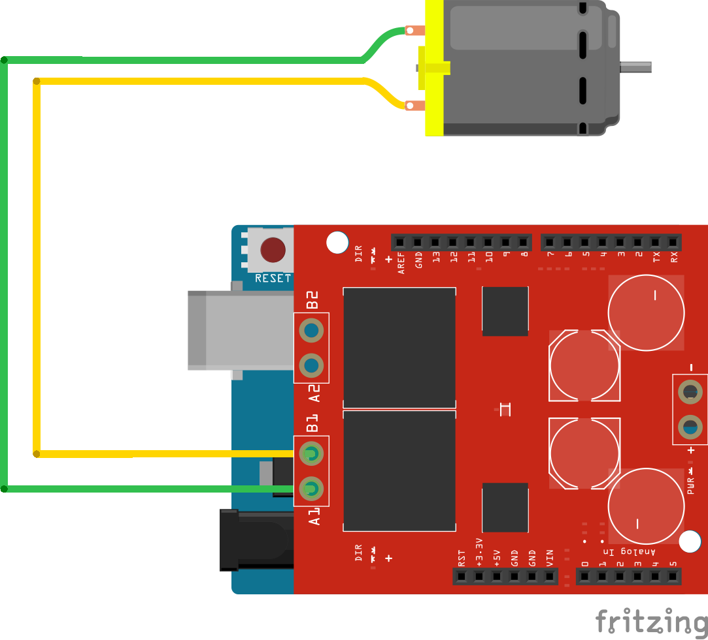

<!--remove-start-->

# Motor - 3 pin

<!--remove-end-->


##### Breadboard for "Motor - 3 pin"


<br>

Fritzing diagram: [docs/breadboard/motor-3-pin.fzz](breadboard/motor-3-pin.fzz)

&nbsp;


Run this example from the command line with:
```bash
node eg/motor-3-pin.js
```


```javascript
const {Board, Motor} = require("johnny-five");
const board = new Board();

board.on("ready", () => {
  /*
    Seeed Studio Motor Shield V1.0, V2.0
      Motor A
        pwm: 9
        dir: 8
        cdir: 11

      Motor B
        pwm: 10
        dir: 12
        cdir: 13

    Freetronics Motor Shield
      Motor A
        pwm: 6
        dir: 5
        cdir: 7

      Motor B
        pwm: 4
        dir: 3
        cdir: 2

   */
  
  const motor = new Motor({
    pins: {
      pwm: 9,
      dir: 8,
      cdir: 11
    }
  });

  board.repl.inject({
    motor
  });

  motor.on("start", () => {
    console.log(`start: ${Date.now()}`);
  });

  motor.on("stop", () => {
    console.log(`automated stop on timer: ${Date.now()}`);
  });

  motor.on("brake", () => {
    console.log(`automated brake on timer: ${Date.now()}`);
  });

  motor.on("forward", () => {
    console.log(`forward: ${Date.now()}`);

    // demonstrate switching to reverse after 5 seconds
    board.wait(5000, () => motor.reverse(255));
  });

  motor.on("reverse", () => {
    console.log(`reverse: ${Date.now()}`);

    // demonstrate braking after 5 seconds
    board.wait(5000, () => motor.brake(500));
  });

  // set the motor going forward full speed
  motor.forward(255);
});

```


&nbsp;

<!--remove-start-->

## License
Copyright (c) 2012-2014 Rick Waldron <waldron.rick@gmail.com>
Licensed under the MIT license.
Copyright (c) 2015-2020 The Johnny-Five Contributors
Licensed under the MIT license.

<!--remove-end-->
