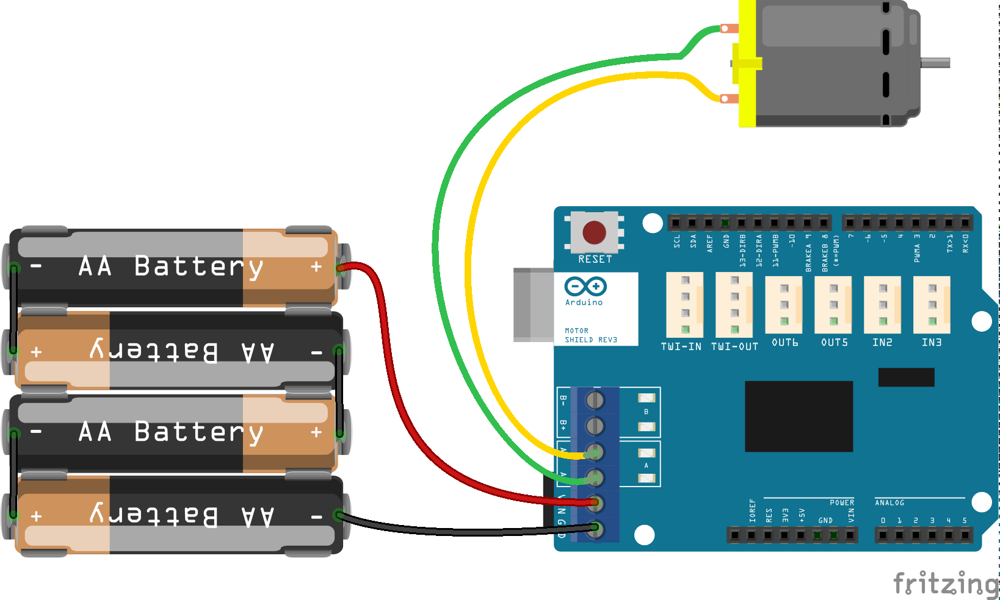

<!--remove-start-->

# Motor - Brake

<!--remove-end-->


##### Breadboard for "Motor - Brake"


<br>

Fritzing diagram: [docs/breadboard/motor-brake.fzz](breadboard/motor-brake.fzz)

&nbsp;


Run this example from the command line with:
```bash
node eg/motor-brake.js
```


```javascript
const {Board, Motor} = require("johnny-five");
const board = new Board();

board.on("ready", () => {
  /*
    Arduino Motor Shield R3
      Motor A
        pwm: 3
        dir: 12
        brake: 9

      Motor B
        pwm: 11
        dir: 13
        brake: 8

   */

  const motor = new Motor({
    pins: {
      pwm: 3,
      dir: 12,
      brake: 9
    }
  });

  board.repl.inject({
    motor
  });

  motor.on("start", () => {
    console.log(`start: ${Date.now()}`);
  });

  motor.on("stop", () => {
    console.log(`automated stop on timer: ${Date.now()}`);
  });

  motor.on("brake", () => {
    console.log(`automated brake on timer: ${Date.now()}`);
  });

  motor.on("forward", () => {
    console.log(`forward: ${Date.now()}`);

    // demonstrate switching to reverse after 5 seconds
    board.wait(5000, () => motor.reverse(150));
  });

  motor.on("reverse", () => {
    console.log(`reverse: ${Date.now()}`);

    // demonstrate stopping after 5 seconds
    board.wait(5000, () => motor.brake(500));
  });

  // set the motor going forward full speed
  motor.forward(255);
});

```


&nbsp;

<!--remove-start-->

## License
Copyright (c) 2012-2014 Rick Waldron <waldron.rick@gmail.com>
Licensed under the MIT license.
Copyright (c) 2015-2020 The Johnny-Five Contributors
Licensed under the MIT license.

<!--remove-end-->
