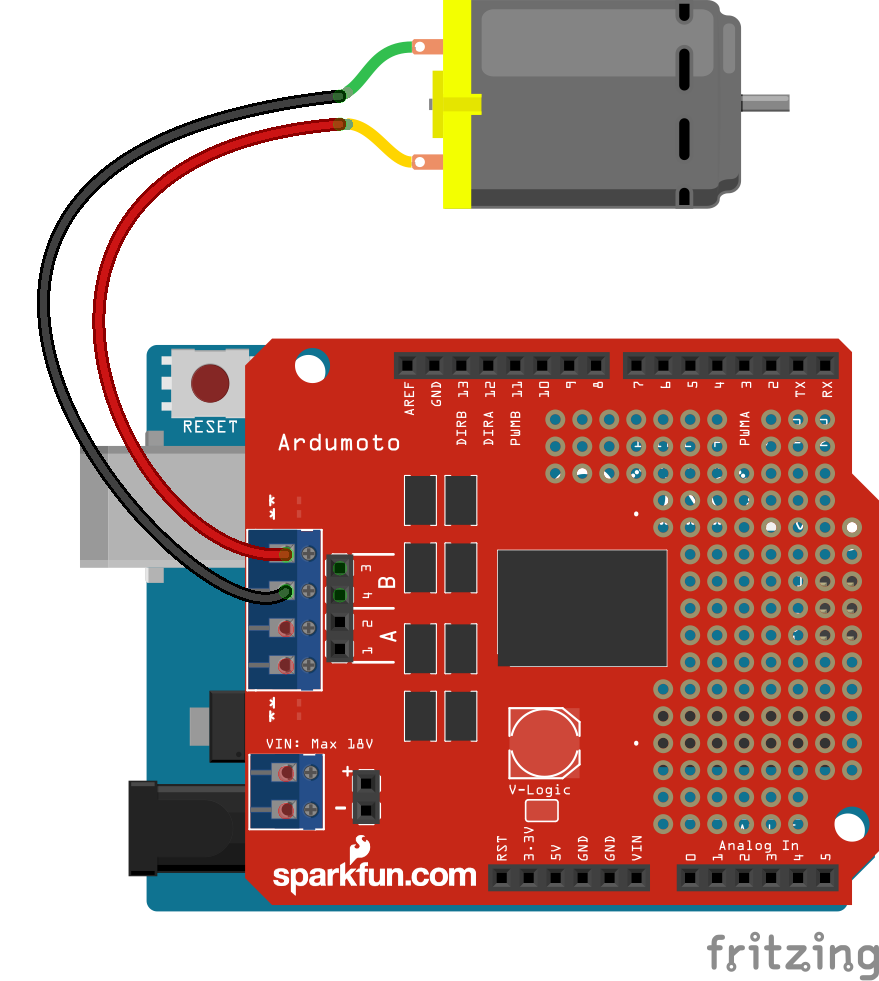

# Motor Directional

Run with:
```bash
node eg/motor-directional.js
```


```javascript
var five = require("johnny-five"),
    board = new five.Board();

board.on("ready", function() {
  var motor;
  /*
    ArduMoto
      Motor A
        pwm: 3
        dir: 12

      Motor B
        pwm: 11
        dir: 13


    AdaFruit Motor Shield
      Motor A
        pwm: ?
        dir: ?

      Motor B
        pwm: ?
        dir: ?


    Bi-Directional Motors can be initialized by:

      new five.Motor([ 3, 12 ]);

    ...is the same as...

      new five.Motor({
        pins: [ 3, 12 ]
      });

    ...is the same as...

      new five.Motor({
        pins: {
          pwm: 3,
          dir: 12
        }
      });

   */


  motor = new five.Motor({
    pins: {
      pwm: 3,
      dir: 12
    }
  });


  board.repl.inject({
    motor: motor
  });

  motor.on("start", function(err, timestamp) {
    console.log("start", timestamp);
  });

  motor.on("stop", function(err, timestamp) {
    console.log("automated stop on timer", timestamp);
  });

  motor.on("forward", function(err, timestamp) {
    console.log("forward", timestamp);

    // demonstrate switching to reverse after 5 seconds
    board.wait(5000, function() {
      motor.reverse(50);
    });
  });

  motor.on("reverse", function(err, timestamp) {
    console.log("reverse", timestamp);

    // demonstrate stopping after 5 seconds
    board.wait(5000, function() {
      motor.stop();
    });
  });

  // set the motor going forward full speed
  motor.forward(255);
});

```


## Breadboard/Illustration



[docs/breadboard/motor-directional.fzz](breadboard/motor-directional.fzz)


## Contributing
All contributions must adhere to the [Idiomatic.js Style Guide](https://github.com/rwldrn/idiomatic.js),
by maintaining the existing coding style. Add unit tests for any new or changed functionality. Lint and test your code using [grunt](https://github.com/cowboy/grunt).

## License
Copyright (c) 2012 Rick Waldron <waldron.rick@gmail.com>
Licensed under the MIT license.
