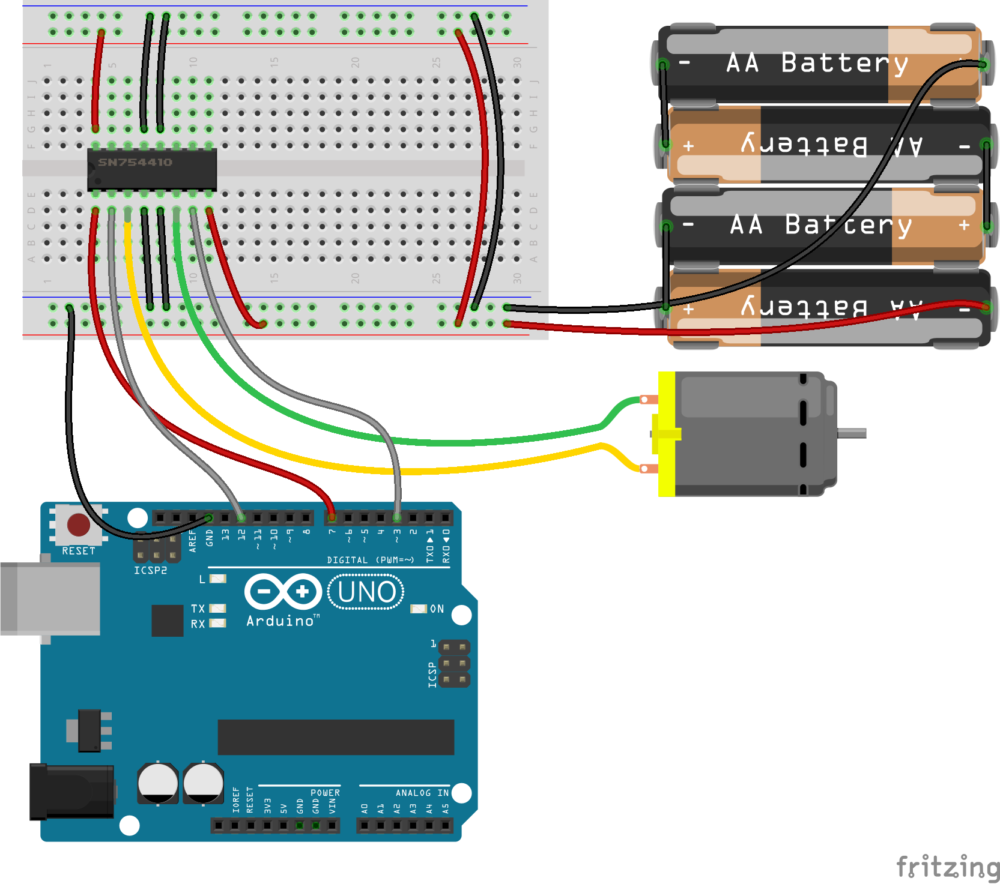

<!--remove-start-->

# Motor - Enable Pin

<!--remove-end-->


##### Enable pin on 7


H-bridge example with enable connected to pin 7 instead of v+.


<br>

Fritzing diagram: [docs/breadboard/motor-enable.fzz](breadboard/motor-enable.fzz)

&nbsp;


Run this example from the command line with:
```bash
node eg/motor-enable.js
```


```javascript
var five = require("johnny-five"),
  board = new five.Board();

board.on("ready", function() {
  var motor;
  /*
    // Motors with an enable pin must be initialized with a pins object

    new five.Motor({
      pins: {
        pwm: 3,
        dir: 12,
        enable: 7
      }
    });

   */


  motor = new five.Motor({
    pins: {
      pwm: 3,
      dir: 12,
      enable: 7
    },
    invertPWM: true
  });

  board.repl.inject({
    motor: motor
  });

  motor.on("stop", function() {
    console.log("automated stop on timer", Date.now());
  });

  motor.on("forward", function() {
    console.log("forward", Date.now());

    // enable the motor after 2 seconds
    board.wait(2000, function() {
      motor.enable();
    });
  });

  motor.on("enable", function() {
    console.log("motor enabled", Date.now());

    // enable the motor after 2 seconds
    board.wait(2000, function() {
      motor.stop();
    });
  });

  motor.on("disable", function() {
    console.log("motor disabled", Date.now());
  });


  // disable the motor
  motor.disable();

  // set the motor going forward full speed (nothing happen)
  motor.forward(255);
});

```


&nbsp;

<!--remove-start-->

## License
Copyright (c) 2012-2014 Rick Waldron <waldron.rick@gmail.com>
Licensed under the MIT license.
Copyright (c) 2015-2019 The Johnny-Five Contributors
Licensed under the MIT license.

<!--remove-end-->
