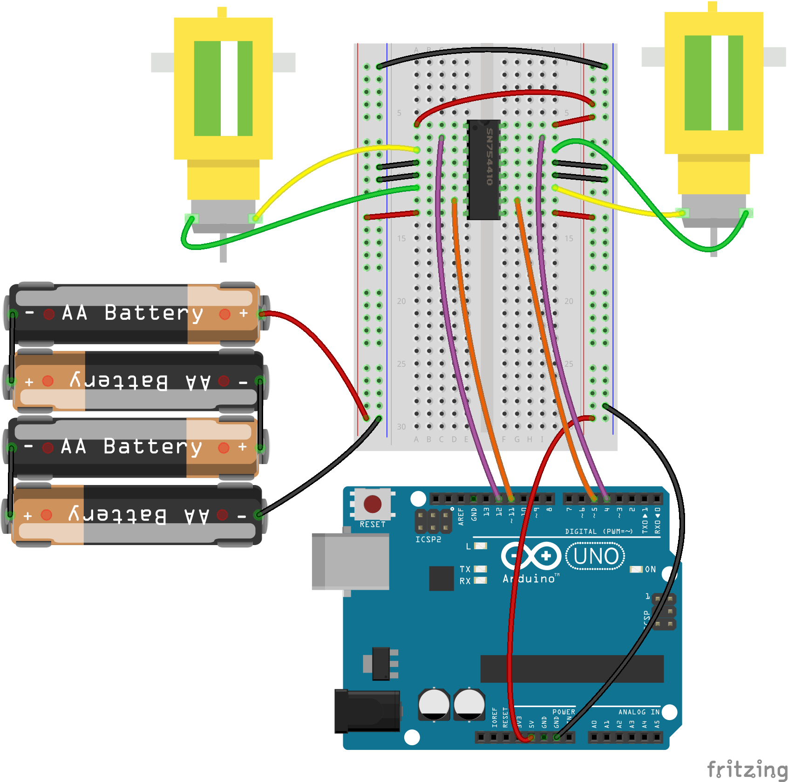

<!--remove-start-->

# Motors - Dual H-Bridge

<!--remove-end-->


##### Breadboard for "Motors - Dual H-Bridge"


<br>

Fritzing diagram: [docs/breadboard/motor-hbridge-dual.fzz](breadboard/motor-hbridge-dual.fzz)

&nbsp;


Run this example from the command line with:
```bash
node eg/motor-hbridge-dual.js
```


```javascript
/**
 * This example is intended for dual H-bridge (quad half H-bridge) motor
 * driver ICs, like the Texas Instruments SN754410. It isn't intended for
 * motor driver breakout boards or more sophisticated drivers, which handle
 * the PWM inversion for you.
 */

const {Board, Motors} = require("johnny-five");
const board = new Board();
const invertPWM = true;

board.on("ready", () => {
  /**
   * Motor A: PWM 11, dir 12
   * Motor B: PWM 5, dir 4
   */
   const motors = new Motors([
     { pins: { dir: 12, pwm: 11 }, invertPWM },
     { pins: { dir: 4, pwm: 5}, invertPWM }
   ]);

  board.repl.inject({
    motors
  });

  // Go forward at full speed for 5 seconds
  console.log("Full speed ahead!");
  motors.forward(255);
  board.wait(4900, motors.stop);

  // Go backwards at full speed for 5 seconds
  board.wait(5000, () => {
    console.log("Now backwards!");
    motors.reverse(255);
    board.wait(4900, motors.stop);
  });

  // Go left...
  board.wait(10000, () => {
    console.log("To the left!");
    motors[0].reverse(200);
    motors[1].forward(200);
    board.wait(4900, motors.stop);
  });

  // Go right...
  board.wait(15000, () => {
    console.log("To the right!");
    motors[0].forward(200);
    motors[1].reverse(200);
    board.wait(4900, motors.stop);
  });

  // Use REPL if you want to go further
  board.wait(20000, () => console.log("Done auto-driving! Use `motors` to control motors in REPL"));

});

```


&nbsp;

<!--remove-start-->

## License
Copyright (c) 2012-2014 Rick Waldron <waldron.rick@gmail.com>
Licensed under the MIT license.
Copyright (c) 2015-2020 The Johnny-Five Contributors
Licensed under the MIT license.

<!--remove-end-->
