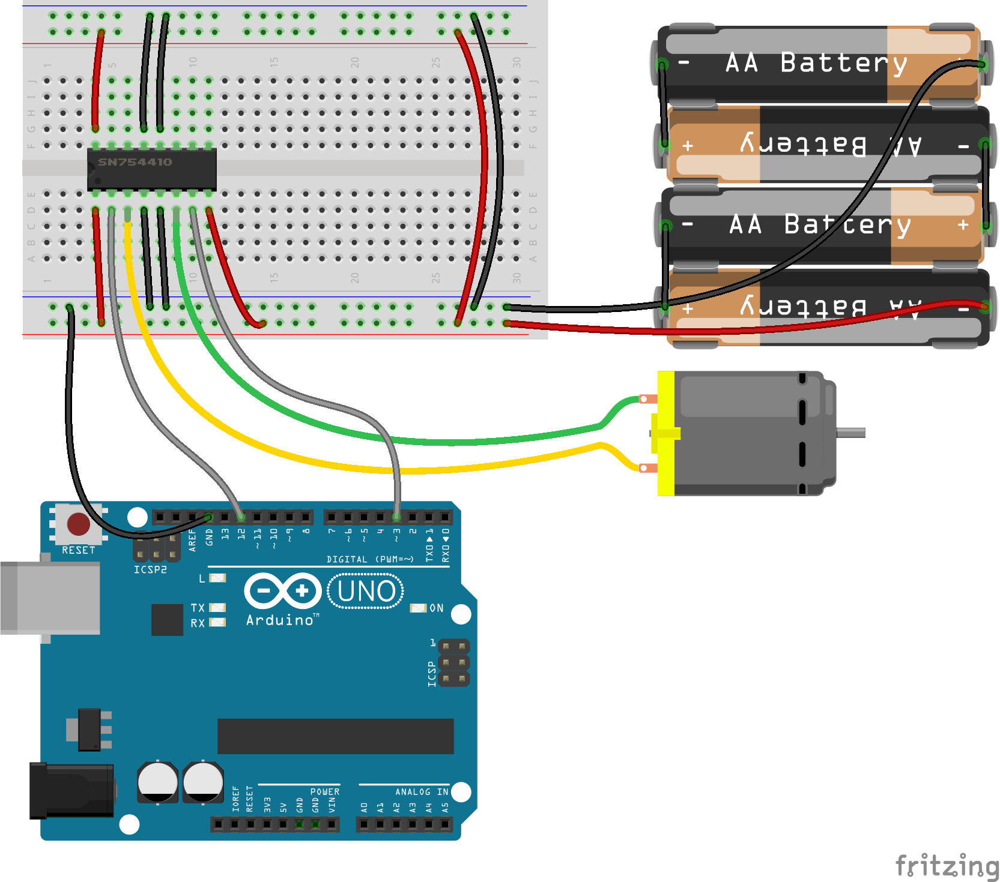

<!--remove-start-->

# Motor - H-Bridge

<!--remove-end-->


##### Breadboard for "Motor - H-Bridge"


<br>

Fritzing diagram: [docs/breadboard/motor-hbridge.fzz](breadboard/motor-hbridge.fzz)

&nbsp;


Run this example from the command line with:
```bash
node eg/motor-hbridge.js
```


```javascript
/*
  IMPORTANT!!! This example is not intended for off the shelf H-Bridge 
  based motor controllers. Off the shelf controllers abstract away 
  the need to invert the PWM (AKA Speed) value when the direction pin 
  is set to high. This is for controllers that do not have that feature.
*/

const {Board, Motor} = require("johnny-five");
const board = new Board();

board.on("ready", () => {
  /*
      Motor A
        pwm: 3
        dir: 12
   */

  const motor = new Motor({
    pins: {
      pwm: 3,
      dir: 12
    },
    invertPWM: true
  });

  board.repl.inject({
    motor
  });

  motor.on("start", () => {
    console.log(`start: ${Date.now()}`);
  });

  motor.on("stop", () => {
    console.log(`automated stop on timer: ${Date.now()}`);
  });

  motor.on("forward", () => {
    console.log(`forward: ${Date.now()}`);

    // demonstrate switching to reverse after 5 seconds
    board.wait(5000, () => motor.reverse(255));
  });

  motor.on("reverse", () => {
    console.log(`reverse: ${Date.now()}`);

    // demonstrate stopping after 5 seconds
    board.wait(5000, motor.stop);
  });

  // set the motor going forward full speed
  motor.forward(255);
});

```


&nbsp;

<!--remove-start-->

## License
Copyright (c) 2012-2014 Rick Waldron <waldron.rick@gmail.com>
Licensed under the MIT license.
Copyright (c) 2015-2020 The Johnny-Five Contributors
Licensed under the MIT license.

<!--remove-end-->
