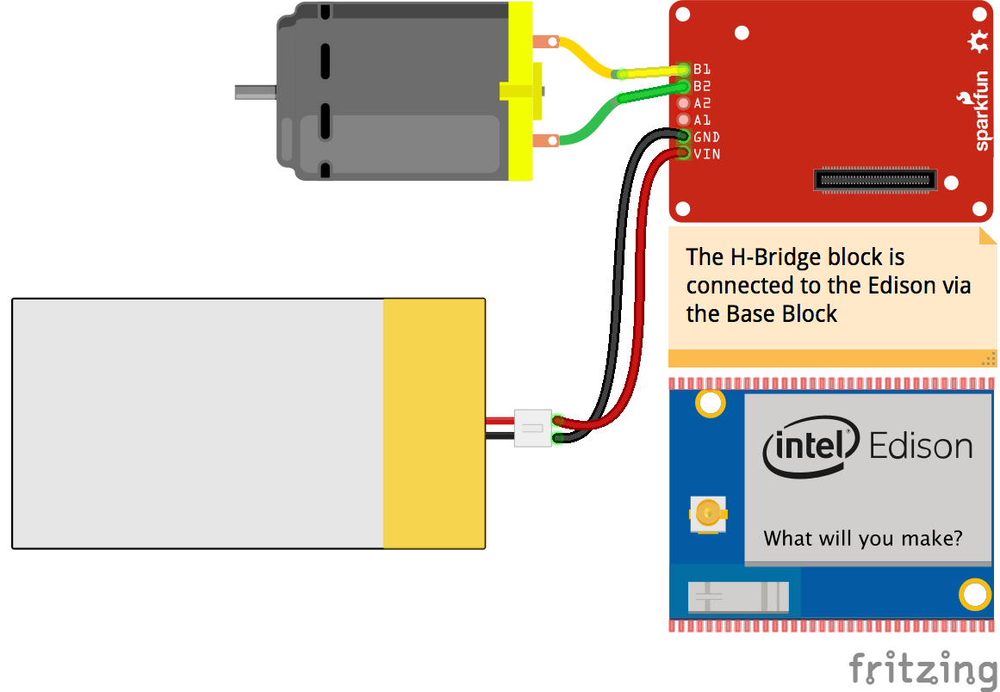

<!--remove-start-->

# Motor - Sparkfun Dual H-bridge Edison Block

<!--remove-end-->


##### Breadboard for "Motor - Sparkfun Dual H-bridge Edison Block"


<br>

Fritzing diagram: [docs/breadboard/motor-sparkfun-edison-hbridge.fzz](breadboard/motor-sparkfun-edison-hbridge.fzz)

&nbsp;


Run this example from the command line with:
```bash
node eg/motor-sparkfun-edison-hbridge.js
```


```javascript
const {Board, Motor} = require("johnny-five");
const Edison = require("galileo-io");
const board = new Board({
  io: new Edison()
});

board.on("ready", () => {
  const config = Motor.SHIELD_CONFIGS.SPARKFUN_DUAL_HBRIDGE_EDISON_BLOCK;
  const motor = new Motor(config.B);

  board.repl.inject({
    motor
  });

  motor.on("stop", () => {
    console.log(`automated stop on timer: ${Date.now()}`);
  });

  motor.on("forward", () => {
    console.log(`forward: ${Date.now()}`);

    // enable the motor after 2 seconds
    board.wait(2000, motor.enable);
  });

  motor.on("enable", () => {
    console.log(`motor enabled: ${Date.now()}`);

    // enable the motor after 2 seconds
    board.wait(2000, motor.stop);
  });

  motor.on("disable", () => {
    console.log(`motor disabled: ${Date.now()}`);
  });


  // // disable the motor
  motor.disable();

  // set the motor going forward full speed (nothing happen)
  motor.forward(255);
});

```


&nbsp;

<!--remove-start-->

## License
Copyright (c) 2012-2014 Rick Waldron <waldron.rick@gmail.com>
Licensed under the MIT license.
Copyright (c) 2015-2020 The Johnny-Five Contributors
Licensed under the MIT license.

<!--remove-end-->
