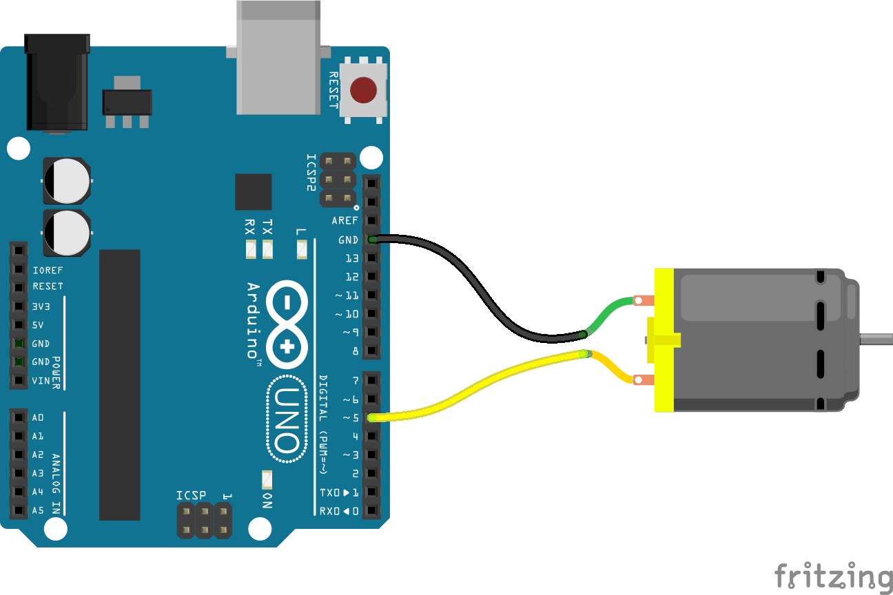

<!--remove-start-->

# Motor

<!--remove-end-->


##### Breadboard for "Motor"


<br>

Fritzing diagram: [docs/breadboard/motor.fzz](breadboard/motor.fzz)

&nbsp;


Run this example from the command line with:
```bash
node eg/motor.js
```


```javascript
const {Board, Motor} = require("johnny-five");
const board = new Board();

board.on("ready", () => {
  // Create a new `motor` hardware instance.
  const motor = new Motor({
    pin: 5
  });

  // Inject the `motor` hardware into
  // the Repl instance's context;
  // allows direct command line access
  board.repl.inject({
    motor
  });

  // Motor Event API

  // "start" events fire when the motor is started.
  motor.on("start", () => {
    console.log(`start: ${Date.now()}`);

    // Demonstrate motor stop in 2 seconds
    board.wait(2000, motor.stop);
  });

  // "stop" events fire when the motor is stopped.
  motor.on("stop", () => {
    console.log(`stop: ${Date.now()}`);
  });

  // Motor API

  // start([speed)
  // Start the motor. `isOn` property set to |true|
  // Takes an optional parameter `speed` [0-255]
  // to define the motor speed if a PWM Pin is
  // used to connect the motor.
  motor.start();

  // stop()
  // Stop the motor. `isOn` property set to |false|
});

```


&nbsp;

<!--remove-start-->

## License
Copyright (c) 2012-2014 Rick Waldron <waldron.rick@gmail.com>
Licensed under the MIT license.
Copyright (c) 2015-2020 The Johnny-Five Contributors
Licensed under the MIT license.

<!--remove-end-->
