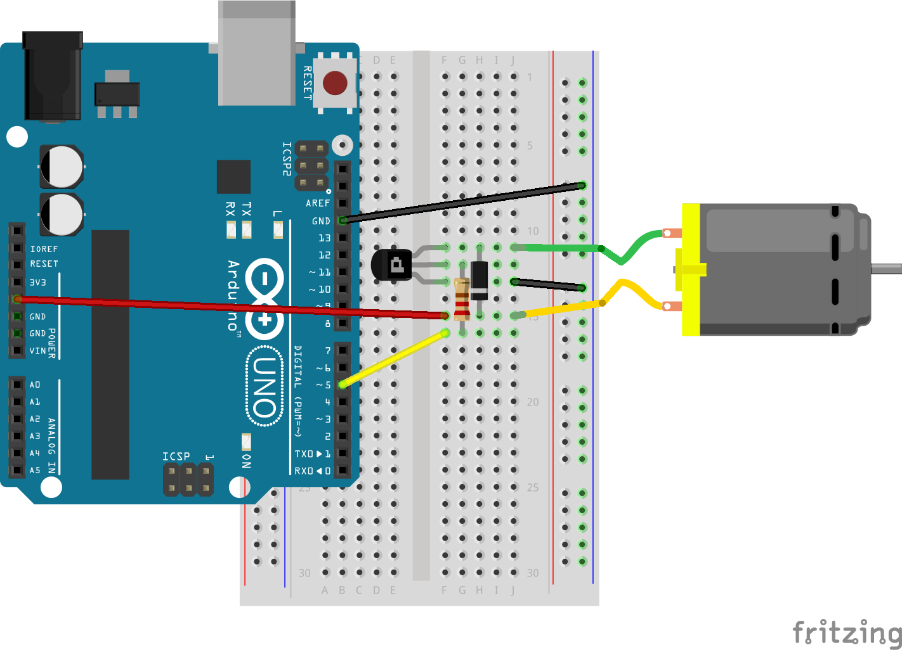

# Motor

Run with:
```bash
node eg/motor.js
```


```javascript
var five = require("johnny-five"),
    board, motor, led;

board = new five.Board();

board.on("ready", function() {
  // Create a new `motor` hardware instance.
  motor = new five.Motor({
    pin: 11
  });

  // Inject the `motor` hardware into
  // the Repl instance's context;
  // allows direct command line access
  board.repl.inject({
    motor: motor
  });

  // Motor Event API

  // "start" events fire when the motor is started.
  motor.on("start", function( err, timestamp ) {
    console.log( "start", timestamp );

    // Demonstrate motor stop in 2 seconds
    board.wait( 2000, function() {
      motor.stop();
    });
  });

  // "stop" events fire when the motor is started.
  motor.on("stop", function( err, timestamp ) {
    console.log( "stop", timestamp );
  });

  // Motor API

  // start()
  // Start the motor. `isOn` property set to |true|
  motor.start();

  // stop()
  // Stop the motor. `isOn` property set to |false|
});

```


## Breadboard/Illustration



[docs/breadboard/motor.fzz](breadboard/motor.fzz)


## Contributing
All contributions must adhere to the [Idiomatic.js Style Guide](https://github.com/rwldrn/idiomatic.js),
by maintaining the existing coding style. Add unit tests for any new or changed functionality. Lint and test your code using [grunt](https://github.com/cowboy/grunt).

## License
Copyright (c) 2012 Rick Waldron <waldron.rick@gmail.com>
Licensed under the MIT license.
