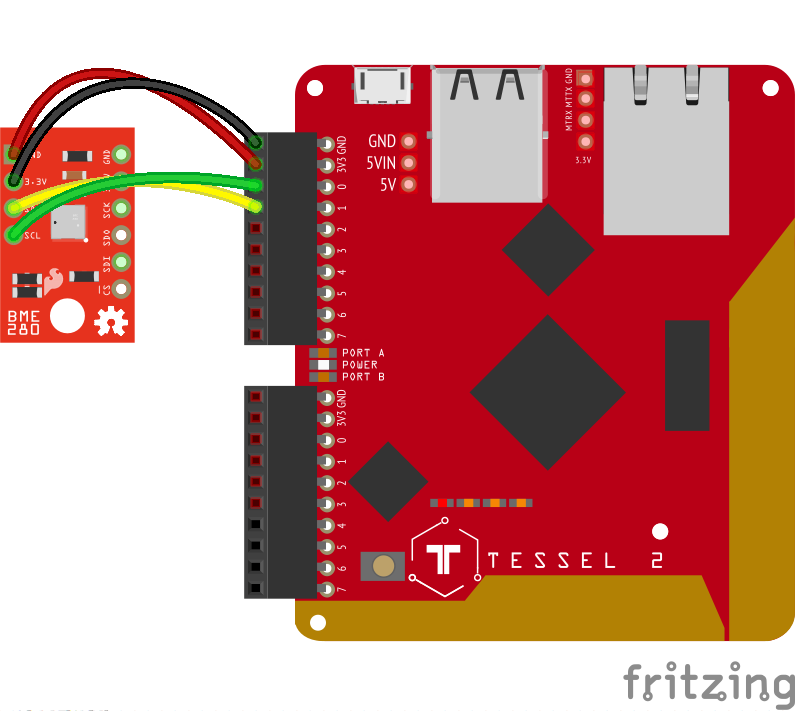
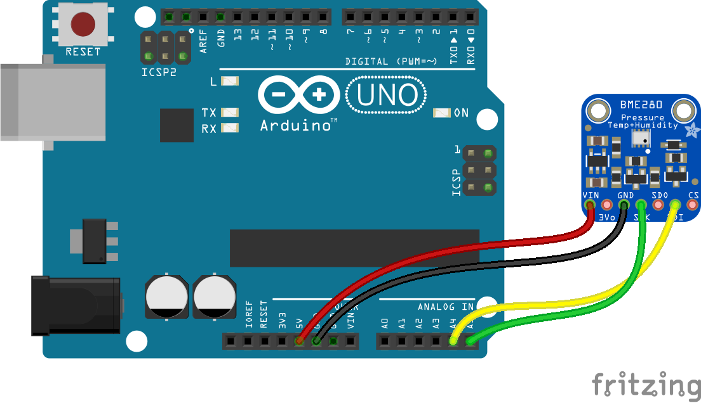

<!--remove-start-->

# Multi - BME280

<!--remove-end-->


##### BME280 (Tessel 2)


<br>

Fritzing diagram: [docs/breadboard/multi-BME280-tessel.fzz](breadboard/multi-BME280-tessel.fzz)

&nbsp;


Run this example from the command line with:
```bash
node eg/multi-BME280.js
```


```javascript
var five = require("../");
var board = new five.Board();

board.on("ready", function() {
  var multi = new five.Multi({
    controller: "BME280"
  });

  multi.on("data", function() {
    console.log("Thermometer");
    console.log("  celsius      : ", this.thermometer.celsius);
    console.log("  fahrenheit   : ", this.thermometer.fahrenheit);
    console.log("  kelvin       : ", this.thermometer.kelvin);
    console.log("--------------------------------------");

    console.log("Barometer");
    console.log("  pressure     : ", this.barometer.pressure);
    console.log("--------------------------------------");

    console.log("Hygrometer");
    console.log("  humidity     : ", this.hygrometer.relativeHumidity);
    console.log("--------------------------------------");

    console.log("Altimeter");
    console.log("  feet         : ", this.altimeter.feet);
    console.log("  meters       : ", this.altimeter.meters);
    console.log("--------------------------------------");
  });
});

```


## Illustrations / Photos


##### BME280 (Arduino)


<br>

Fritzing diagram: [docs/breadboard/multi-BME280-arduino.fzz](breadboard/multi-BME280-arduino.fzz)

&nbsp;


## Learn More

- [SparkFun Atmospheric Sensor Breakout - BME280](https://www.sparkfun.com/products/13676)

- [Adafruit BME280 I2C or SPI Temperature Humidity Pressure Sensor](https://www.adafruit.com/products/2652)

&nbsp;

<!--remove-start-->

## License
Copyright (c) 2012-2014 Rick Waldron <waldron.rick@gmail.com>
Licensed under the MIT license.
Copyright (c) 2015-2020 The Johnny-Five Contributors
Licensed under the MIT license.

<!--remove-end-->
