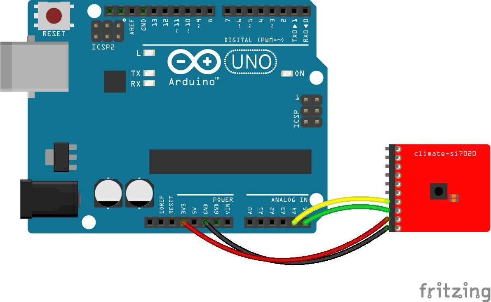

<!--remove-start-->

# Multi - SI7020

<!--remove-end-->


##### Tessel with SI7020


<br>

Fritzing diagram: [docs/breadboard/temperature-SI7020.fzz](breadboard/temperature-SI7020.fzz)

&nbsp;


Run this example from the command line with:
```bash
node eg/multi-SI7020.js
```


```javascript
var five = require("../");
var board = new five.Board();

board.on("ready", function() {
  var multi = new five.Multi({
    controller: "SI7020" // HTU21D
  });

  multi.on("change", function() {
    console.log("Thermometer");
    console.log("  celsius           : ", this.thermometer.celsius);
    console.log("  fahrenheit        : ", this.thermometer.fahrenheit);
    console.log("  kelvin            : ", this.thermometer.kelvin);
    console.log("--------------------------------------");

    console.log("Hygrometer");
    console.log("  relative humidity : ", this.hygrometer.relativeHumidity);
    console.log("--------------------------------------");
  });
});


```


## Illustrations / Photos


##### Arduino with SI7020


<br>

Fritzing diagram: [docs/breadboard/temperature-SI7020-uno.fzz](breadboard/temperature-SI7020-uno.fzz)

&nbsp;


## Additional Notes
- [SI7020 - Climate](http://start.tessel.io/modules/climate)


## Learn More

- [SI7020 - I2C Multi Sensor](https://tessel.io/docs/climate)

&nbsp;

<!--remove-start-->

## License
Copyright (c) 2012-2014 Rick Waldron <waldron.rick@gmail.com>
Licensed under the MIT license.
Copyright (c) 2015-2020 The Johnny-Five Contributors
Licensed under the MIT license.

<!--remove-end-->
