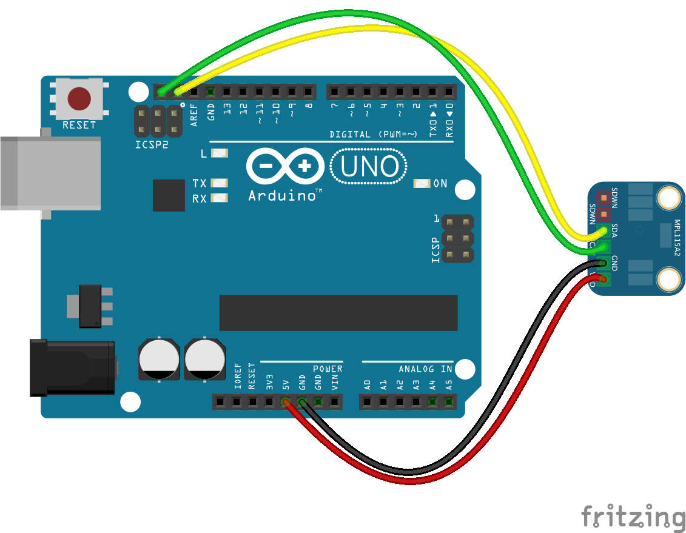

<!--remove-start-->

# Multi - MPL115A2

<!--remove-end-->


##### Breadboard for "Multi - MPL115A2"


<br>

Fritzing diagram: [docs/breadboard/multi-mpl115a2.fzz](breadboard/multi-mpl115a2.fzz)

&nbsp;


Run this example from the command line with:
```bash
node eg/multi-mpl115a2.js
```


```javascript
var five = require("../");
var board = new five.Board();

board.on("ready", function() {
  var multi = new five.Multi({
    controller: "MPL115A2"
  });

  multi.on("change", function() {
    console.log("Thermometer");
    console.log("  celsius      : ", this.thermometer.celsius);
    console.log("  fahrenheit   : ", this.thermometer.fahrenheit);
    console.log("  kelvin       : ", this.thermometer.kelvin);
    console.log("--------------------------------------");

    console.log("Barometer");
    console.log("  pressure     : ", this.barometer.pressure);
    console.log("--------------------------------------");
  });
});

```


## Learn More

- [MPL115A2 - I2C Barometric Pressure/Temperature Sensor](https://www.adafruit.com/product/992)

&nbsp;

<!--remove-start-->

## License
Copyright (c) 2012-2014 Rick Waldron <waldron.rick@gmail.com>
Licensed under the MIT license.
Copyright (c) 2015-2020 The Johnny-Five Contributors
Licensed under the MIT license.

<!--remove-end-->
