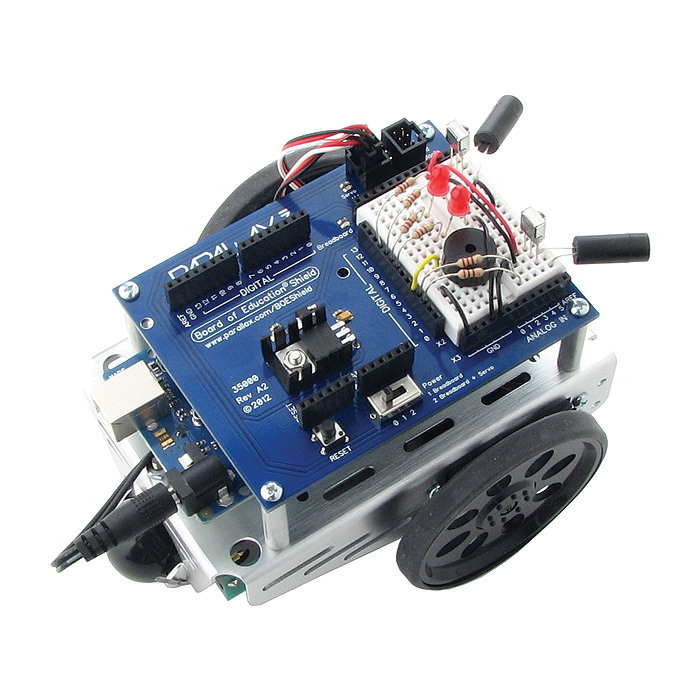

<!--remove-start-->

# Nodebot

<!--remove-end-->


Run this example from the command line with:
```bash
node eg/nodebot.js
```


```javascript
var five, temporal, Nodebot;

five = require("johnny-five");
/**
 * Any time-based scheduling
 * should use temporal
 */
temporal = require("temporal");

/**
 * Programs MUST initialize a serial
 * communication "channel" with the board
 * before executing hardware-specific code
 */
five.Board().on("ready", function() {

  /**
   * Initialize an instance of Nodebot
   * with properties "right" and "left"
   * whose values must correspond to the
   * pin for each respective servo.
   */
  Nodebot = new five.Nodebot({
    right: 10,
    left: 11
  });

  /**
   * Inject Nodebot instance into REPL,
   * this will allow a user to navigate
   * and control the Nodebot via the
   * command line
   */
  this.repl.inject({
    n: Nodebot
  });

  /**
   * The following methods may be called
   * from the "n" object on the command
   * line to control/navigate the
   * Nodebot.
   *
   * speed
   *   A number 1-5; 1 is slow, 5 is fast.
   *
   * n.fwd(speed)
   *   Drive the Nodebot forward at a
   *   specified speed.
   *
   * n.rev(speed)
   *   Drive the Nodebot in reverse at a
   *   specified speed.
   *
   * n.left(time = 500)
   *   Turn the Nodebot left for a
   *   specified amount of time in ms.
   *   Defaults to 500ms
   *
   * n.right(time = 500)
   *   Turn the Nodebot right for a
   *   specified amount of time in ms.
   *   Defaults to 500ms
   *
   * n.stop()
   *   Stop the Nodebot
   *
   * n.pivot(instruction)
   *   Pivot the Nodebot based on an
   *   instruction string.
   *   Instructions include:
   *     - "forward-right" or "f-r"
   *     - "forward-left" or "f-l"
   *     - "reverse-right" or "r-r"
   *     - "reverse-left" or "r-l"
   */
});

```


## Illustrations / Photos


### Complete Nodebot


Nodebots come in many flavors, but this is a typical setup.


  


&nbsp;

<!--remove-start-->

## License
Copyright (c) 2012-2014 Rick Waldron <waldron.rick@gmail.com>
Licensed under the MIT license.
Copyright (c) 2015-2020 The Johnny-Five Contributors
Licensed under the MIT license.

<!--remove-end-->
