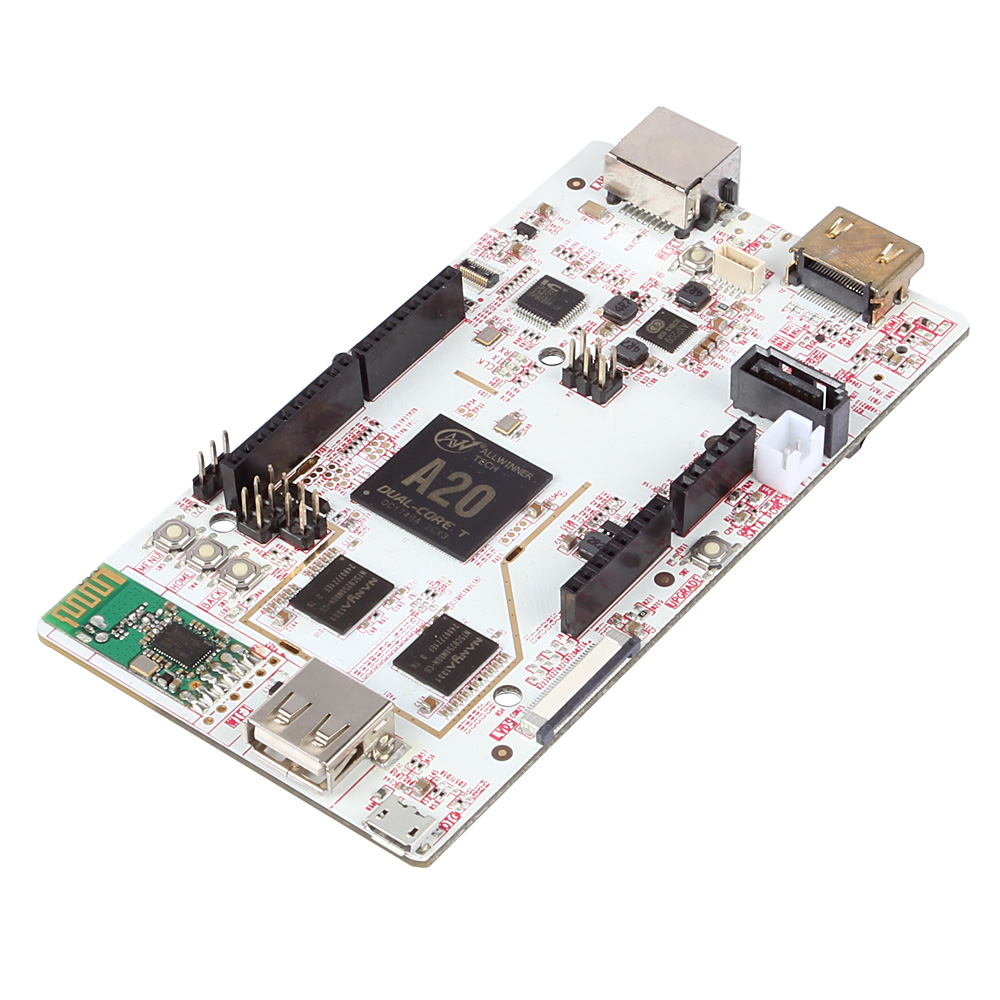

<!--remove-start-->

# Led Blink on pcDuino3

<!--remove-end-->


Example using Johnny-Five + pcDuino-IO to directly control a pcDuino3


Run this example from the command line with:
```bash
node eg/pcduino-io.js
```


```javascript
var five = require("johnny-five");
var pcDuino = require("pcduino-io");
var board = new five.Board({
  io: new pcDuino()
});

board.on("ready", function() {
  var led = new five.Led(13);
  led.blink();
});


```


## Illustrations / Photos


### pcDuino3


  


## Additional Notes
In order to use the pcduino-io library, you will need to install node (0.10.x or better)
and npm on your pcduino. Once the environment is created, install Johnny-Five and pcDuino-IO.
[Setup environment](https://github.com/rwaldron/pcduino-io#install-a-compatible-version-of-nodenpm)
```sh
npm install johnny-five pcduino-io
```


## Learn More

- [pcduino-io on GitHub](https://github.com/rwaldron/pcduino-io/)

&nbsp;

<!--remove-start-->

## License
Copyright (c) 2012-2014 Rick Waldron <waldron.rick@gmail.com>
Licensed under the MIT license.
Copyright (c) 2015-2020 The Johnny-Five Contributors
Licensed under the MIT license.

<!--remove-end-->
