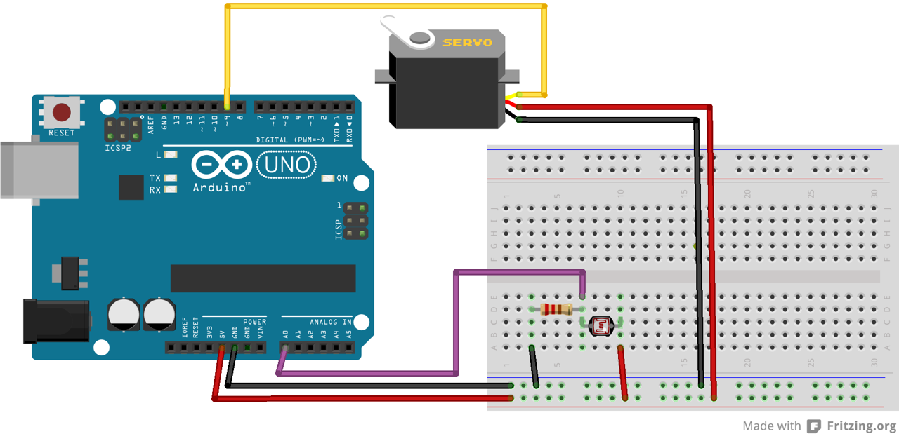

# Photoresistor Servo

Run with:
```bash
node eg/photoresistor-servo.js
```


```javascript
var five = require("johnny-five"),
    board, photoresistor, servo, range;

board = new five.Board();

board.on("ready", function() {

  //range for the servo (degrees)
  //CAUTION: don't set the numbers past what you servo can handle
  //         it could potentially damage the servo
  range = [ 0, 159 ];

  // Create a new `photoresistor` hardware instance.
  photoresistor = new five.Sensor({
    //pin to listen to
    pin: "A0",
    //how often to check for a change in miliseconds (default value is 25 milliseconds)
    freq: 250
  });

  // Create a new `servo` hardware instance.
  servo = new five.Servo({
    //what pin to control server
    pin: 9,

    //how far the servo turns
    range: range
  });

  // Inject the `photoresistor` hardware into
  // the Repl instance's context;
  // allows direct command line access
  board.repl.inject({
    pot: photoresistor,
    servo: servo
  });

  //equate the photoresistor values to the servo scale
  //do something when the a value is read from the photoresistor
  photoresistor.scale( range ).on("data", function() {
    //outputs to screen the values being used from the photoresistor
    //console.log( "Normalized value: " + this.normalized + "  Scaled Value: " + this.scaled );

    //tell the servo arm to move the scaled value.
    servo.move( Math.floor(this.scaled));
  });

});

```


## Breadboard/Illustration



[docs/breadboard/photoresistor-servo.fzz](breadboard/photoresistor-servo.fzz)


## Contributing
All contributions must adhere to the [Idiomatic.js Style Guide](https://github.com/rwldrn/idiomatic.js),
by maintaining the existing coding style. Add unit tests for any new or changed functionality. Lint and test your code using [grunt](https://github.com/cowboy/grunt).

## License
Copyright (c) 2012 Rick Waldron <waldron.rick@gmail.com>
Licensed under the MIT license.
