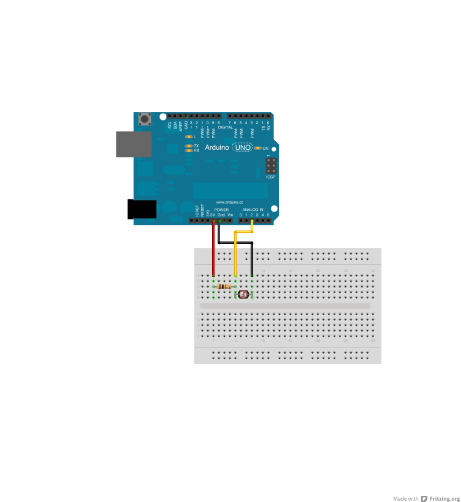

# Photoresistor

Run with:
```bash
node eg/photoresistor.js
```


```javascript
var five = require("johnny-five"),
    board, photoresistor;

board = new five.Board();

board.on("ready", function() {

  // Create a new `photoresistor` hardware instance.
  photoresistor = new five.Sensor({
    pin: "A2",
    freq: 250
  });

  // Inject the `sensor` hardware into
  // the Repl instance's context;
  // allows direct command line access
  board.repl.inject({
    pot: photoresistor
  });

  // "read" get the current reading from the photoresistor
  photoresistor.on("read", function( err, value ) {
    console.log( value, this.normalized );
  });
});


// References
//
// http://nakkaya.com/2009/10/29/connecting-a-photoresistor-to-an-arduino/

```

## Breadboard/Illustration


[docs/breadboard/photoresistor.fzz](breadboard/photoresistor.fzz)


## Devices


## Documentation

_(Nothing yet)_


## Contributing
All contributions must adhere to the [Idiomatic.js Style Guide](https://github.com/rwldrn/idiomatic.js),
by maintaining the existing coding style. Add unit tests for any new or changed functionality. Lint and test your code using [grunt](https://github.com/cowboy/grunt).

## Release History
_(Nothing yet)_

## License
Copyright (c) 2012 Rick Waldron <waldron.rick@gmail.com>
Licensed under the MIT license.
