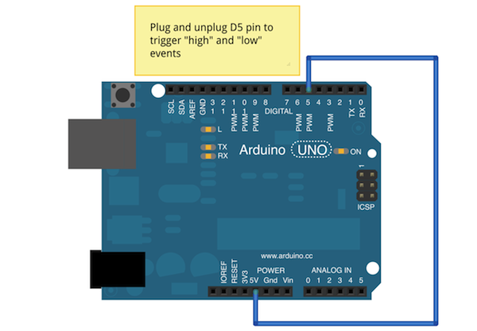

# Pin Circuit Event

Run with:
```bash
node eg/pin-circuit-event.js
```


```javascript
var five = require("johnny-five");

new five.Board().on("ready", function() {
  var pin = new five.Pin(5);

  // Event tests
  [ "high", "low" ].forEach(function( type ) {
    pin.on( type, function() {
      console.log( "Circuit Event: ", type );
    });
  });
});

```

## Breadboard/Illustration


[docs/breadboard/pin-circuit-event.fzz](breadboard/pin-circuit-event.fzz)


## Devices


## Documentation

_(Nothing yet)_


## Contributing
All contributions must adhere to the [Idiomatic.js Style Guide](https://github.com/rwldrn/idiomatic.js),
by maintaining the existing coding style. Add unit tests for any new or changed functionality. Lint and test your code using [grunt](https://github.com/cowboy/grunt).

## Release History
_(Nothing yet)_

## License
Copyright (c) 2012 Rick Waldron <waldron.rick@gmail.com>
Licensed under the MIT license.
