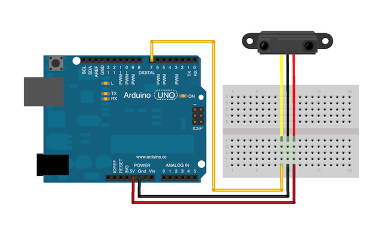

# Ping

Run with:
```bash
node eg/ping.js
```


```javascript
var five = require("johnny-five"),
    board, ping;

board = new five.Board();

board.on("ready", function() {

  // Create a new `ping` hardware instance.
  ping = new five.Ping(7);

  // Properties

  // ping.microseconds
  //
  // Roundtrip distance in microseconds
  //

  // ping.inches
  //
  // Calculated distance to object in inches
  //

  // ping.cm
  //
  // Calculated distance to object in centimeters
  //


  // Ping Event API

  // "read" get the current reading from the ping
  ping.on("read", function( err, value ) {
    console.log( "read", value );
  });

  ping.on("change", function( err, value ) {

    console.log( typeof this.inches );
    console.log( "Object is " + this.inches + "inches away" );
  });
});

```

## Breadboard/Illustration


[docs/breadboard/ping.fzz](breadboard/ping.fzz)


## Devices


## Documentation

_(Nothing yet)_


## Contributing
All contributions must adhere to the [Idiomatic.js Style Guide](https://github.com/rwldrn/idiomatic.js),
by maintaining the existing coding style. Add unit tests for any new or changed functionality. Lint and test your code using [grunt](https://github.com/cowboy/grunt).

## Release History
_(Nothing yet)_

## License
Copyright (c) 2012 Rick Waldron <waldron.rick@gmail.com>
Licensed under the MIT license.
