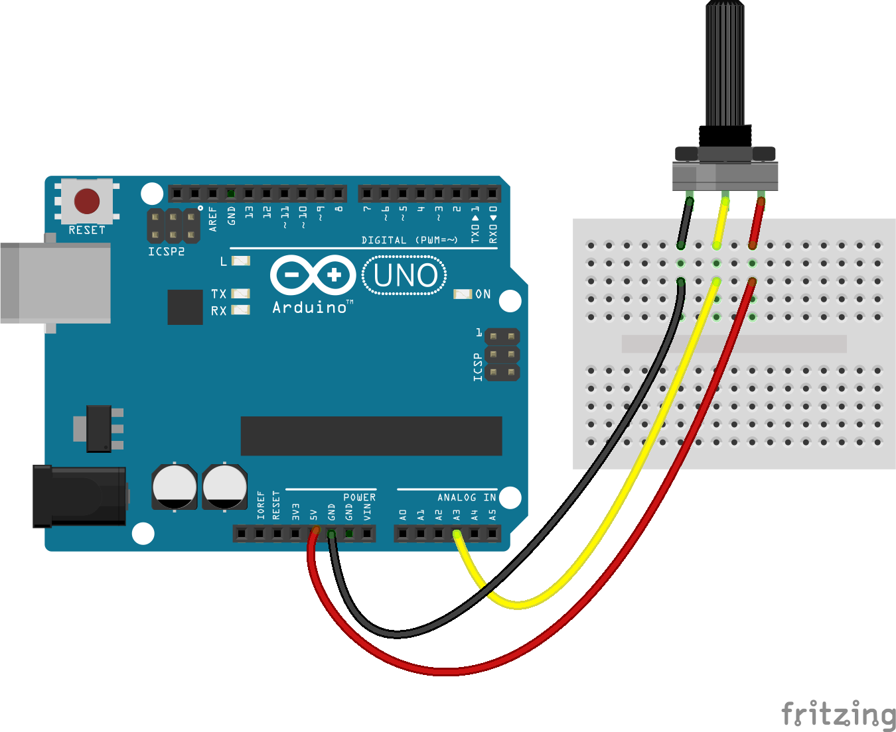

<!--remove-start-->

# Sensor - Potentiometer

<!--remove-end-->


##### Breadboard for "Sensor - Potentiometer"


<br>

Fritzing diagram: [docs/breadboard/potentiometer.fzz](breadboard/potentiometer.fzz)

&nbsp;


Run this example from the command line with:
```bash
node eg/potentiometer.js
```


```javascript
const { Board, Sensor } = require("johnny-five");
const board = new Board();

board.on("ready", () => {
  const potentiometer = new Sensor("A3");

  potentiometer.on("change", () => {
    const {value, raw} = potentiometer;
    console.log("Sensor: ");
    console.log("  value  : ", value);
    console.log("  raw    : ", raw);
    console.log("-----------------");
  });
});


// References
//
// http://arduino.cc/en/Tutorial/AnalogInput

```


&nbsp;

<!--remove-start-->

## License
Copyright (c) 2012-2014 Rick Waldron <waldron.rick@gmail.com>
Licensed under the MIT license.
Copyright (c) 2015-2020 The Johnny-Five Contributors
Licensed under the MIT license.

<!--remove-end-->
