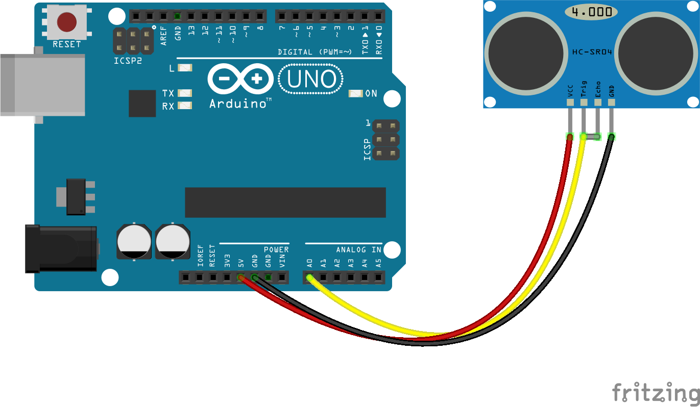

<!--remove-start-->

# Proximity - HC-SR04 (Analog)

<!--remove-end-->


'Ultrasonic Ping' Proximity example for any of the [`PING_PULSE_IN`](http://johnny-five.io/api/proximity/#controller-alias-table) components (eg. `HCSR04` or Parallax's Ultrasonic Ping). [PingFirmata](http://johnny-five.io/api/proximity/#pingfirmata) must be loaded onto Arduino-compatible boards to enable this component.


##### Breadboard for "Proximity - HC-SR04 (Analog)"


<br>

Fritzing diagram: [docs/breadboard/proximity-hcsr04-analog.fzz](breadboard/proximity-hcsr04-analog.fzz)

&nbsp;


Run this example from the command line with:
```bash
node eg/proximity-hcsr04-analog.js
```


```javascript
var five = require("johnny-five");
var board = new five.Board();

board.on("ready", function() {
  var proximity = new five.Proximity({
    controller: "HCSR04",
    pin: "A0"
  });

  proximity.on("data", function() {
    console.log("Proximity: ");
    console.log("  cm  : ", this.cm);
    console.log("  in  : ", this.in);
    console.log("-----------------");
  });

  proximity.on("change", function() {
    console.log("The obstruction has moved.");
  });
});

```


&nbsp;

<!--remove-start-->

## License
Copyright (c) 2012, 2013, 2014 Rick Waldron <waldron.rick@gmail.com>
Licensed under the MIT license.
Copyright (c) 2018 The Johnny-Five Contributors
Licensed under the MIT license.

<!--remove-end-->
