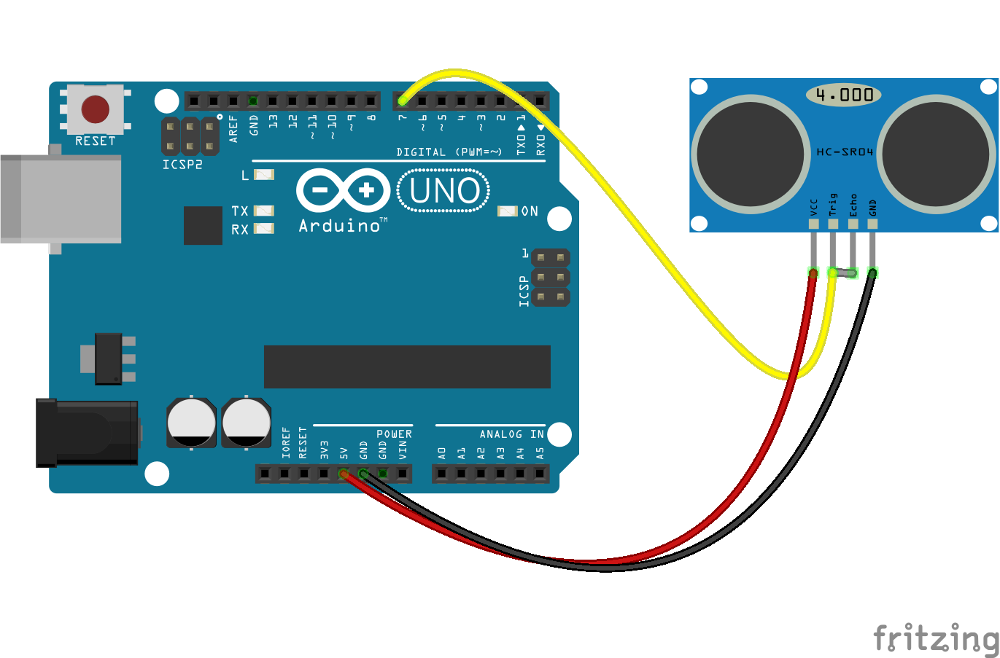

<!--remove-start-->

# Proximity - HC-SR04

<!--remove-end-->


'Ultrasonic Ping' Proximity example for any of the [`PING_PULSE_IN`](http://johnny-five.io/api/proximity/#controller-alias-table) components (eg. `HCSR04` or Parallax's Ultrasonic Ping). [PingFirmata](http://johnny-five.io/api/proximity/#pingfirmata) must be loaded onto Arduino-compatible boards to enable this component.


##### Breadboard for "Proximity - HC-SR04"


<br>

Fritzing diagram: [docs/breadboard/proximity-hcsr04.fzz](breadboard/proximity-hcsr04.fzz)

&nbsp;


Run this example from the command line with:
```bash
node eg/proximity-hcsr04.js
```


```javascript
const { Board, Proximity } = require("johnny-five");
const board = new Board();

board.on("ready", () => {
  const proximity = new Proximity({
    controller: "HCSR04",
    pin: 7
  });

  proximity.on("change", () => {
    const {centimeters, inches} = proximity;
    console.log("Proximity: ");
    console.log("  cm  : ", centimeters);
    console.log("  in  : ", inches);
    console.log("-----------------");
  });
});

```


&nbsp;

<!--remove-start-->

## License
Copyright (c) 2012-2014 Rick Waldron <waldron.rick@gmail.com>
Licensed under the MIT license.
Copyright (c) 2015-2020 The Johnny-Five Contributors
Licensed under the MIT license.

<!--remove-end-->
