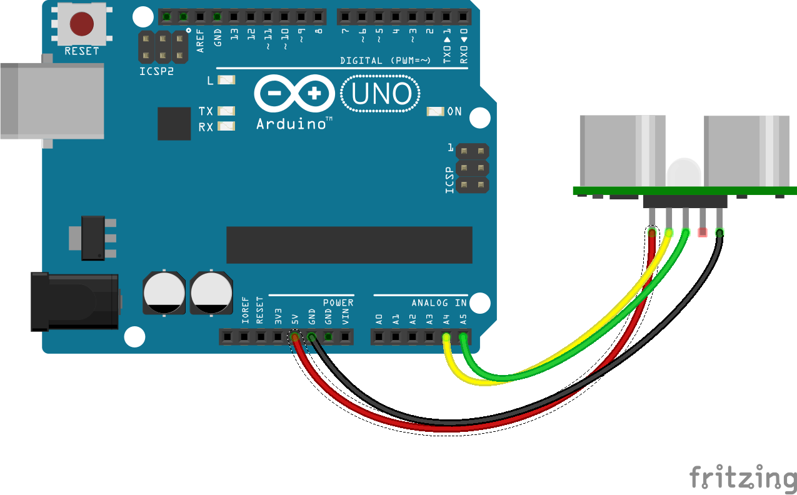

<!--remove-start-->

# Sonar


Basic sonar Proximity example


Run with:
```bash
node eg/proximity-sonar.js
```

<!--remove-end-->

```javascript
var five = require("johnny-five"),
  prox, led;

five.Board().on("ready", function() {

  var proximity = new five.Proximity({
    controller: "SRF10"
  });

  proximity.on("data", function(data) {
    console.log(data.cm + "cm");
  });

});

```


## Illustrations / Photos


### SRF10 Sensor


Basic example with SRF10 I2C sensor


<br>
Fritzing diagram: [docs/breadboard/proximity-sonar-srf10.fzz](breadboard/proximity-sonar-srf10.fzz)

&nbsp;


&nbsp;

<!--remove-start-->

## License
Copyright (c) 2012, 2013, 2014 Rick Waldron <waldron.rick@gmail.com>
Licensed under the MIT license.
Copyright (c) 2014, 2015 The Johnny-Five Contributors
Licensed under the MIT license.

<!--remove-end-->
