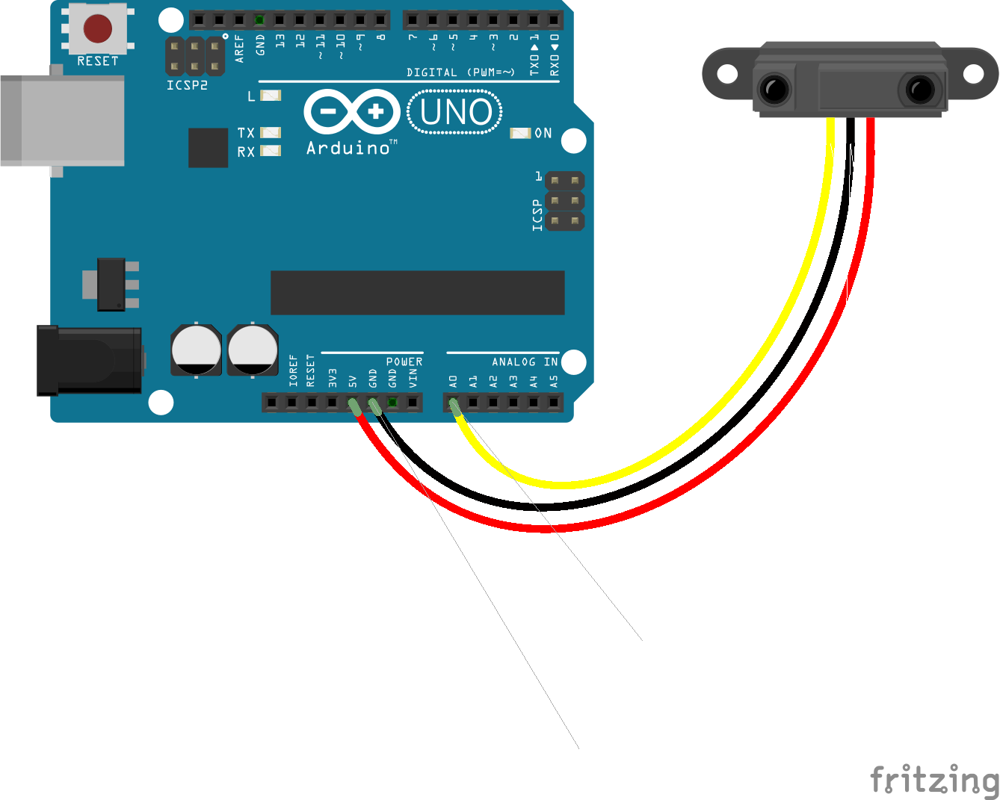

<!--remove-start-->

# Proximity


Basic infrared Proximity example


Run with:
```bash
node eg/proximity.js
```

<!--remove-end-->

```javascript
var five = require("johnny-five");
var board = new five.Board();

board.on("ready", function() {
  var proximity = new five.Proximity({
    controller: "GP2Y0A21YK",
    pin: "A0"
  });

  proximity.on("data", function() {
    console.log(this.cm + "cm", this.in + "in");
  });

  proximity.on("change", function() {
    console.log("The obstruction has moved.");
  });
});

```


## Illustrations / Photos


### Breadboard for "Proximity"


<br>

Fritzing diagram: [docs/breadboard/proximity.fzz](breadboard/proximity.fzz)

&nbsp;


&nbsp;

<!--remove-start-->

## License
Copyright (c) 2012, 2013, 2014 Rick Waldron <waldron.rick@gmail.com>
Licensed under the MIT license.
Copyright (c) 2014, 2015 The Johnny-Five Contributors
Licensed under the MIT license.

<!--remove-end-->
