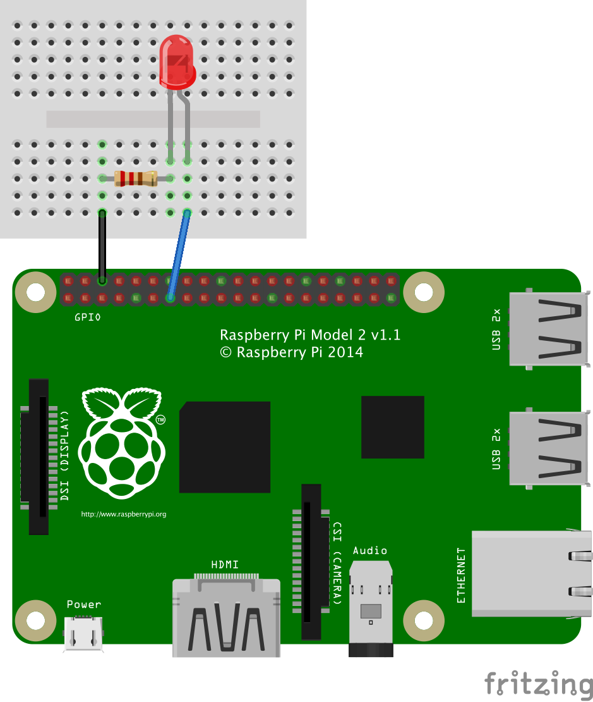

<!--remove-start-->

# Led Blink on Raspberry Pi

<!--remove-end-->


Example using Johnny-Five + Raspi-IO to directly control a Raspberry Pi


##### LED on pin P1-13


<br>

Fritzing diagram: [docs/breadboard/led-13-raspberry-pi.fzz](breadboard/led-13-raspberry-pi.fzz)

&nbsp;


Run this example from the command line with:
```bash
node eg/raspi-io.js
```


```javascript
var five = require("johnny-five");
var Raspi = require("raspi-io").RaspiIO;
var board = new five.Board({
  io: new Raspi()
});

board.on("ready", function() {
  var led = new five.Led("P1-13");
  led.blink();
});


```


## Additional Notes
In order to use the Raspi-IO library, it is recommended that you use
the Raspbian OS. Others may work, but are untested.
```sh
npm install johnny-five raspi-io
```


## Learn More

- [raspi-io on GitHub](https://github.com/nebrius/raspi-io/)

&nbsp;

<!--remove-start-->

## License
Copyright (c) 2012-2014 Rick Waldron <waldron.rick@gmail.com>
Licensed under the MIT license.
Copyright (c) 2015-2020 The Johnny-Five Contributors
Licensed under the MIT license.

<!--remove-end-->
