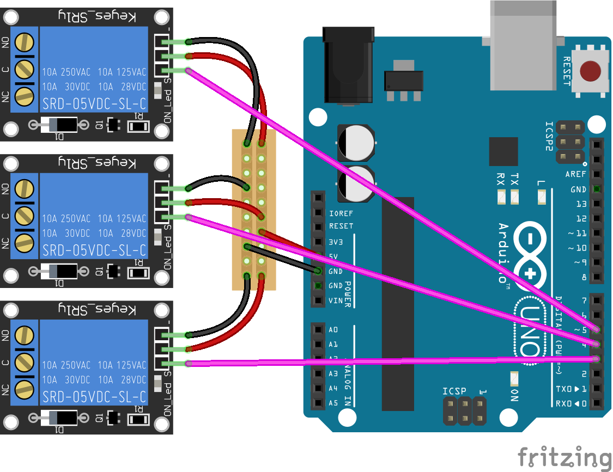

<!--remove-start-->

# Relay - Collection

<!--remove-end-->


##### Breadboard for "Relay - Collection"


<br>

Fritzing diagram: [docs/breadboard/relay-collection.fzz](breadboard/relay-collection.fzz)

&nbsp;


Run this example from the command line with:
```bash
node eg/relay-collection.js
```


```javascript
var five = require("johnny-five");
var board = new five.Board();

board.on("ready", function() {

  var relays = new five.Relays([3, 4, 5]);

  board.loop(2000, function() {
    // Toggle the state of all relays
    relays.toggle();
  });
});

```


&nbsp;

<!--remove-start-->

## License
Copyright (c) 2012-2014 Rick Waldron <waldron.rick@gmail.com>
Licensed under the MIT license.
Copyright (c) 2015-2020 The Johnny-Five Contributors
Licensed under the MIT license.

<!--remove-end-->
