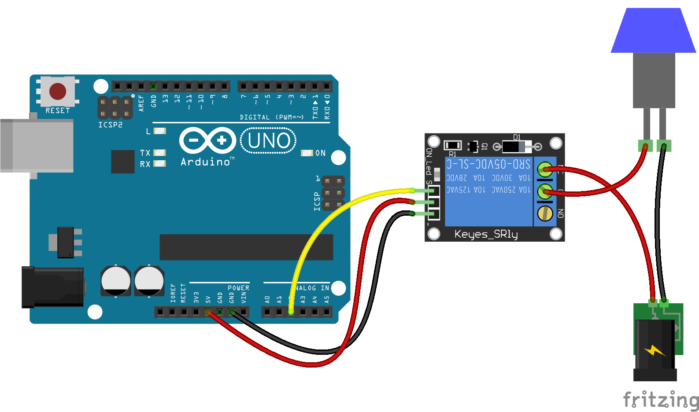

<!--remove-start-->

# Relay On Analog Pin

<!--remove-end-->


##### Breadboard for "Relay On Analog Pin"


<br>

Fritzing diagram: [docs/breadboard/relay-on-analog-pin.fzz](breadboard/relay-on-analog-pin.fzz)

&nbsp;


Run this example from the command line with:
```bash
node eg/relay-on-analog-pin.js
```


```javascript
var five = require("../");
var board = new five.Board();

board.on("ready", function() {

  var relay = new five.Relay({
    pin: "A2"
  });

  setInterval(function() {
    relay.toggle();
  }, 1000);
});

```


&nbsp;

<!--remove-start-->

## License
Copyright (c) 2012-2014 Rick Waldron <waldron.rick@gmail.com>
Licensed under the MIT license.
Copyright (c) 2015-2020 The Johnny-Five Contributors
Licensed under the MIT license.

<!--remove-end-->
