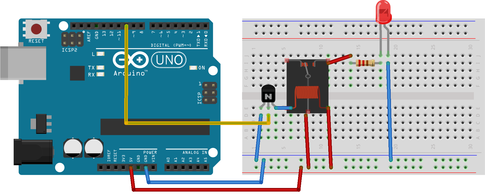

# Relay

Run with:
```bash
node eg/relay.js
```


```javascript
var five = require("johnny-five"),
  board = new five.Board();

board.on("ready", function() {
  var relay = new five.Relay(process.argv[2] || 10);

  this.repl.inject({
    relay: relay
  });
});
```


## Breadboard/Illustration



[docs/breadboard/relay.fzz](breadboard/relay.fzz)


## Contributing
All contributions must adhere to the [Idiomatic.js Style Guide](https://github.com/rwldrn/idiomatic.js),
by maintaining the existing coding style. Add unit tests for any new or changed functionality. Lint and test your code using [grunt](https://github.com/cowboy/grunt).

## License
Copyright (c) 2012 Rick Waldron <waldron.rick@gmail.com>
Licensed under the MIT license.
