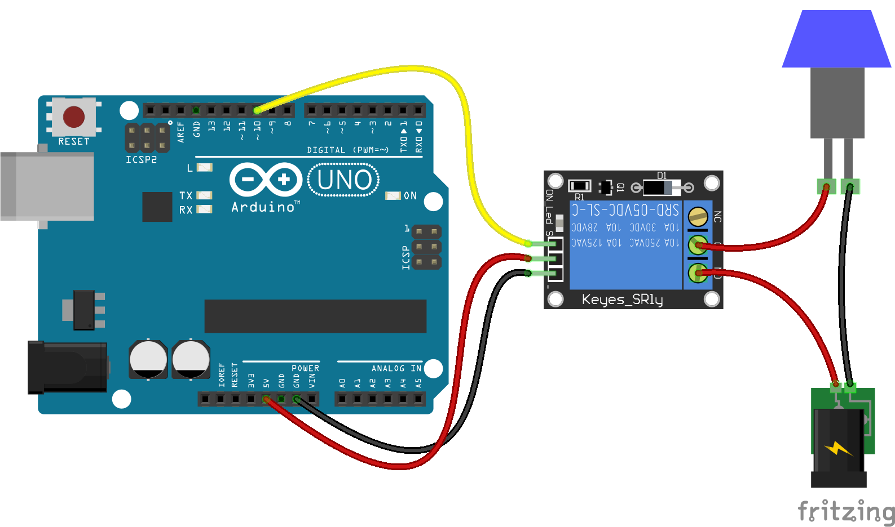
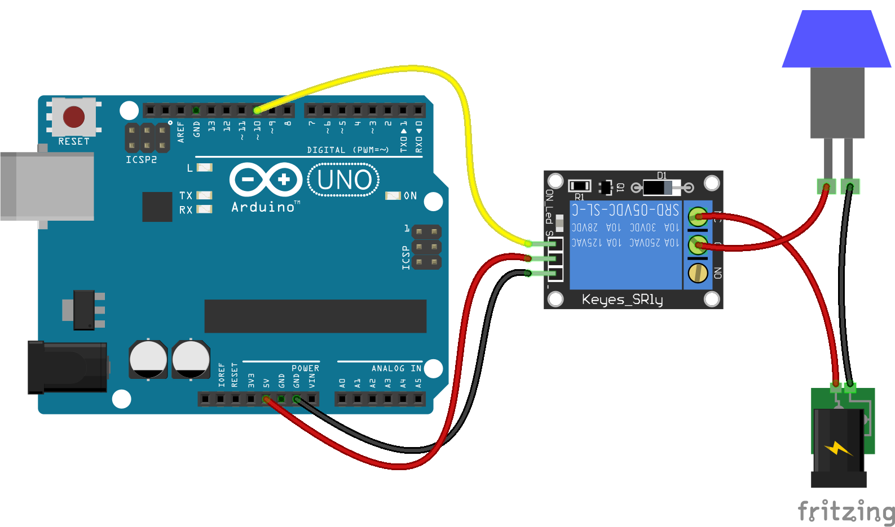

<!--remove-start-->

# Relay

<!--remove-end-->


##### Relay - normally open


The breadboard diagram shows a Keyes Relay, however any Relay will work.


<br>

Fritzing diagram: [docs/breadboard/relay-open.fzz](breadboard/relay-open.fzz)

&nbsp;


Run this example from the command line with:
```bash
node eg/relay.js
```


```javascript
var five = require("johnny-five");
var board = new five.Board();

board.on("ready", function() {
  var relay = new five.Relay(10);

  // Control the relay in real time
  // from the REPL by typing commands, eg.
  //
  // relay.on();
  //
  // relay.off();
  //
  this.repl.inject({
    relay: relay
  });
});

```


## Illustrations / Photos


##### Relay - normally closed


The breadboard diagram shows a Keyes Relay, however any Relay will work.


<br>

Fritzing diagram: [docs/breadboard/relay-closed.fzz](breadboard/relay-closed.fzz)

&nbsp;


## Additional Notes
- [JavaScript: Relay Control with Johnny-Five on Node](http://bocoup.com/weblog/javascript-relay-with-johnny-five/)

&nbsp;

<!--remove-start-->

## License
Copyright (c) 2012-2014 Rick Waldron <waldron.rick@gmail.com>
Licensed under the MIT license.
Copyright (c) 2015-2020 The Johnny-Five Contributors
Licensed under the MIT license.

<!--remove-end-->
