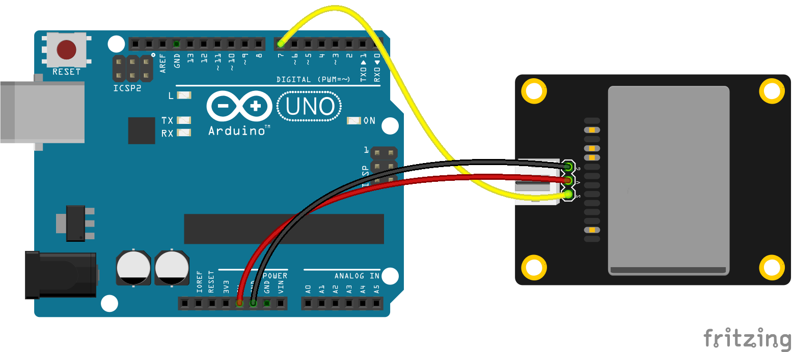

<!--remove-start-->

# Sensor - Digital Microwave

<!--remove-end-->


##### Breadboard for "Sensor - Digital Microwave"


<br>

Fritzing diagram: [docs/breadboard/sensor-digital-microwave.fzz](breadboard/sensor-digital-microwave.fzz)

&nbsp;


Run this example from the command line with:
```bash
node eg/sensor-digital-microwave.js
```


```javascript
var five = require("johnny-five");
var board = new five.Board();

board.on("ready", () => {
  var microwave = new five.Sensor.Digital(7);

  microwave.on("change", () => {
    console.log(microwave.value);
  });
});

```


&nbsp;

<!--remove-start-->

## License
Copyright (c) 2012-2014 Rick Waldron <waldron.rick@gmail.com>
Licensed under the MIT license.
Copyright (c) 2015-2020 The Johnny-Five Contributors
Licensed under the MIT license.

<!--remove-end-->
