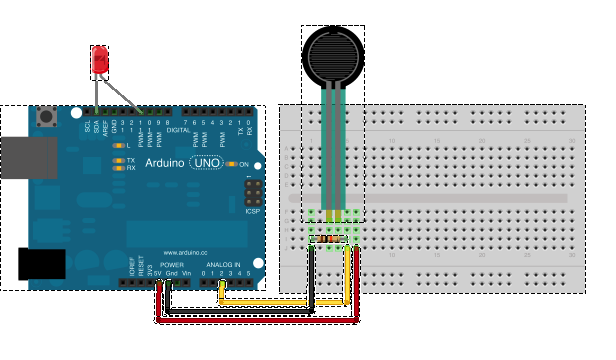

# Sensor Fsr

Run with:
```bash
node eg/sensor-fsr.js
```


```javascript
var five = require("johnny-five"),
    fsr, led;

(new five.Board()).on("ready", function() {

  // Create a new `fsr` hardware instance.
  fsr = new five.Sensor({
    pin: "A0",
    freq: 25
  });

  led = new five.Led(9);

  // Scale the sensor's value to the LED's brightness range
  fsr.scale([ 0, 255 ]).on("data", function() {

    // set the led's brightness based on force
    // applied to force sensitive resistor

    led.brightness( this.value );
  });
});

```


## Breadboard/Illustration



[docs/breadboard/sensor-fsr.fzz](breadboard/sensor-fsr.fzz)


## Contributing
All contributions must adhere to the [Idiomatic.js Style Guide](https://github.com/rwldrn/idiomatic.js),
by maintaining the existing coding style. Add unit tests for any new or changed functionality. Lint and test your code using [grunt](https://github.com/cowboy/grunt).

## License
Copyright (c) 2012 Rick Waldron <waldron.rick@gmail.com>
Licensed under the MIT license.
