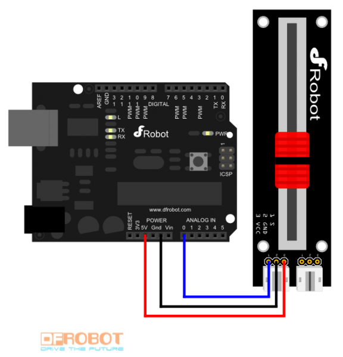

<!--remove-start-->

# Sensor - Slide potentiometer

<!--remove-end-->


##### Breadboard for "Sensor - Slide potentiometer"


<br>

Fritzing diagram: [docs/breadboard/sensor-slider.fzz](breadboard/sensor-slider.fzz)

&nbsp;


Run this example from the command line with:
```bash
node eg/sensor-slider.js
```


```javascript
var five = require("johnny-five");
var board = new five.Board();

board.on("ready", function() {

  var slider = new five.Sensor("A0");

  // "slide" is an alias for "change"
  slider.scale([0, 100]).on("slide", function() {
    console.log("slide", this.value);
  });
});

```


&nbsp;

<!--remove-start-->

## License
Copyright (c) 2012-2014 Rick Waldron <waldron.rick@gmail.com>
Licensed under the MIT license.
Copyright (c) 2015-2020 The Johnny-Five Contributors
Licensed under the MIT license.

<!--remove-end-->
