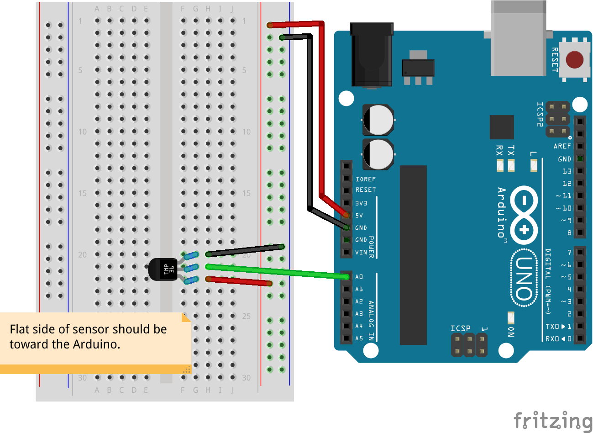

# Sensor Temperature Tmp36

Run with:
```bash
node eg/sensor-temperature-tmp36.js
```


```javascript
var five = require("johnny-five"),
    board, sensor;

board = new five.Board();

board.on("ready", function() {
  // This example is for the TMP36 analog temperature sensor
  sensor = new five.Sensor("A0");

  function analogToCelsius(analogValue) {
    // For the TMP36 sensor specifically
    return ((analogValue * 0.004882814) - 0.5) * 100;
  }

  function analogToFahrenheit(analogValue) {
    return analogToCelsius(analogValue) * ( 9/5 ) + 32;
  }

  sensor.on("data", function() {
    var celsiusValue, fahrenheitValue;
    // Obtain temperature from current analog value
    celsiusValue    = analogToCelsius(this.value);
    fahrenheitValue = analogToFahrenheit(this.value);
    console.log(celsiusValue + "°C", fahrenheitValue + "°F");
  });
});


```


## Breadboard/Illustration



[docs/breadboard/sensor-temperature-tmp36.fzz](breadboard/sensor-temperature-tmp36.fzz)

- [TMP36 - Temperature Sensor](https://www.sparkfun.com/products/10988)


## License
Copyright (c) 2012-2013 Rick Waldron <waldron.rick@gmail.com>
Licensed under the MIT license.
Copyright (c) 2014 The Johnny-Five Contributors
Licensed under the MIT license.
