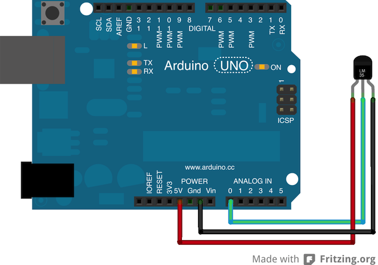

# Sensor Temperature

Run with:
```bash
node eg/sensor-temperature.js
```


```javascript
var five = require("johnny-five");

five.Board().on("ready", function(){
  var sensor = new five.Sensor("A0");

  sensor.on("data", function(){
    var voltage = this.value * 0.004882814;
    var celsius = (voltage - 0.5) * 100;
    var fahrenheit = celsius * (9/5) + 32;

    console.log(celsius + "°C", fahrenheit + "°F");
  });
});


```


## Breadboard/Illustration



[docs/breadboard/sensor-temperature.fzz](breadboard/sensor-temperature.fzz)


- [TMP36 - Temperature Sensor](https://www.sparkfun.com/products/10988)


## Contributing
All contributions must adhere to the [Idiomatic.js Style Guide](https://github.com/rwldrn/idiomatic.js),
by maintaining the existing coding style. Add unit tests for any new or changed functionality. Lint and test your code using [grunt](https://github.com/cowboy/grunt).

## License
Copyright (c) 2012 Rick Waldron <waldron.rick@gmail.com>
Licensed under the MIT license.
