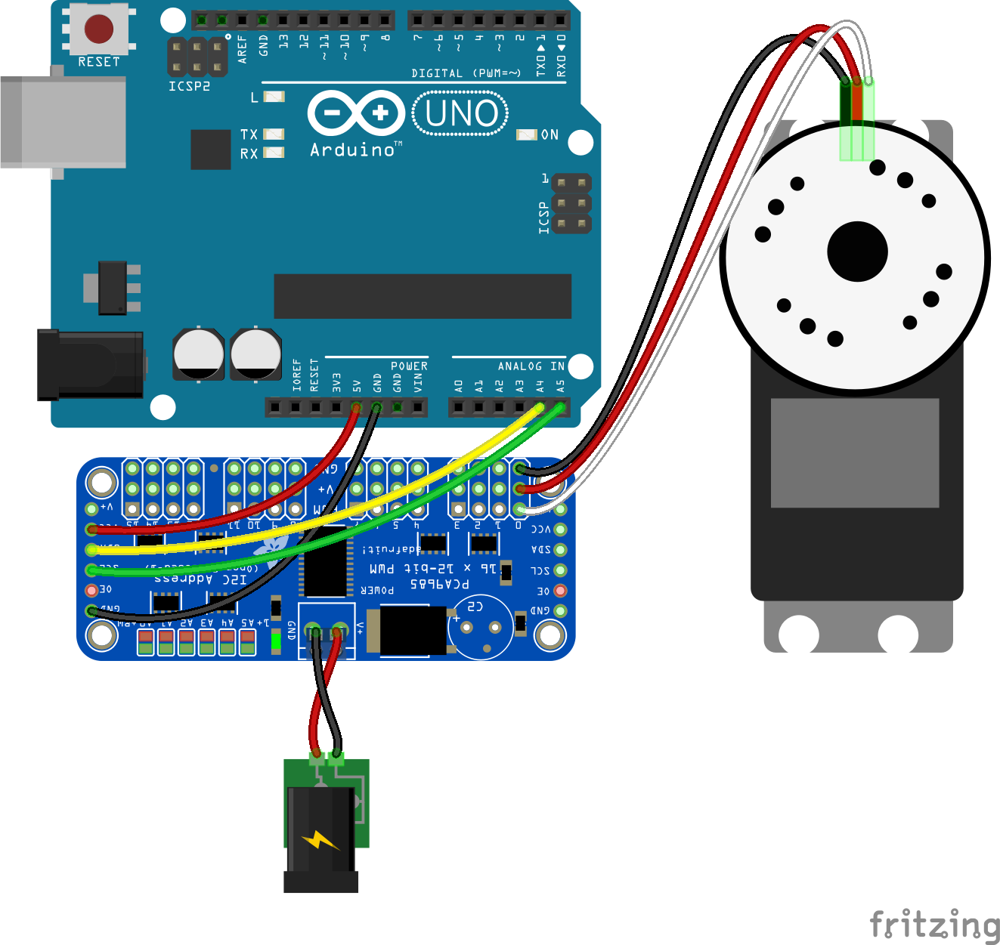

<!--remove-start-->

# Servo - PCA9685

<!--remove-end-->


##### Breadboard for "Servo - PCA9685"


<br>

Fritzing diagram: [docs/breadboard/servo-PCA9685.fzz](breadboard/servo-PCA9685.fzz)

&nbsp;


Run this example from the command line with:
```bash
node eg/servo-PCA9685.js
```


```javascript
const {Board, Servo} = require("johnny-five");
const board = new Board();
const controller = "PCA9685";

board.on("ready", () => {
  console.log("Connected");

  // Initialize the servo instance
  const a = new Servo({
    controller,
    pin: 0,
  });

  const b = new Servo({
    controller,
    range: [0, 180],
    pin: 1,
  });

  a.to(0);
  b.to(0);
  
});

```


&nbsp;

<!--remove-start-->

## License
Copyright (c) 2012-2014 Rick Waldron <waldron.rick@gmail.com>
Licensed under the MIT license.
Copyright (c) 2015-2020 The Johnny-Five Contributors
Licensed under the MIT license.

<!--remove-end-->
