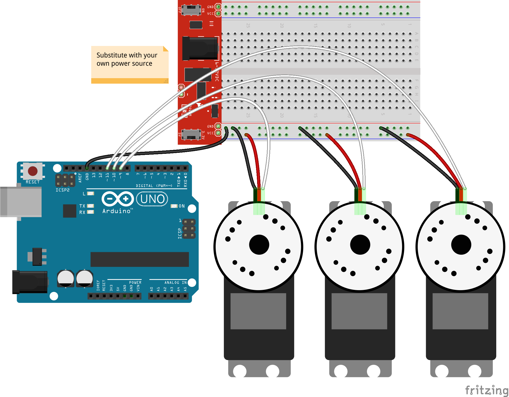

<!--remove-start-->

# Servo - Leg Animation

<!--remove-end-->


##### Servos on pins 9, 10, 11


Servos connected to pins 9, 10, and 11. Requires servos on pins that support PWM (usually denoted by ~).


<br>

Fritzing diagram: [docs/breadboard/servo-three.fzz](breadboard/servo-three.fzz)

&nbsp;


Run this example from the command line with:
```bash
node eg/servo-animation-leg.js
```


```javascript
const {Animation, Board, Servo, Servos} = require("johnny-five");
let ph = {
  state: "sleep"
};

const board = new Board();

board.on("ready", () => {

  /**
   * This animation controls three servos
   * The servos are the coxa, femur and tibia of a single
   * leg on a hexapod. A full hexapod might need 18
   * servo instances (assuming 3 degrees of freedom)
   */
  ph.coxa = new Servo({
    pin: 9,
    startAt: 45
  });
  ph.femur = new Servo({
    pin: 10,
    startAt: 180
  });
  ph.tibia = new Servo({
    pin: 11,
    startAt: 180
  });

  // Create a Servos instance for those leg parts
  ph.leg = new Servos([ph.coxa, ph.femur, ph.tibia]);

  /**
   * Create an Animation(target) object. A newly initialized
   * animation object is essentially an empty queue (array) for
   * animation segments that will run asynchronously.
   * @param {target} A Servo or Servos instance to be animated
   */
  const legAnimation = new Animation(ph.leg);

  /**
   * This object describes an animation segment and is passed into
   * our animation with the enqueue method. The only required
   * property is keyFrames. See the Animation wiki page for a full
   * list of available properties
   */
  const sleep = {
    duration: 500,
    cuePoints: [0, 0.5, 1.0],
    oncomplete() {
      ph.state = "sleep";
    },
    keyFrames: [
      [null, false, { degrees: 45, easing: "outCirc" }],
      [null, { degrees: 136, easing: "inOutCirc" }, { degrees: 180, easing: "inOutCirc" }],
      [null, { degrees: 120, easing: "inOutCirc" }, { step: 60, easing: "inOutCirc" }]
    ]
  };

  /**
   * Another animation segment
   */
  const stand = {
    duration: 500,
    loop: false,
    cuePoints: [0, 0.1, 0.3, 0.7, 1.0],
    oncomplete() {
      ph.state = "stand";
    },
    keyFrames: [
      [null, { degrees: 66 }],
      [null, false, false, { degrees: 130, easing: "outCirc"}, { degrees: 104, easing: "inCirc"}],
      [null, false, { degrees: 106}, false, { degrees: 93 }]
    ]
  };

  // Functions we can call from the REPL
  ph.sleep = () => legAnimation.enqueue(sleep);
  ph.stand = () => legAnimation.enqueue(stand);

  // Inject the `servo` hardware into;
  // the Repl instance's context;
  // allows direct command line access
  board.repl.inject({
    ph
  });

  console.log("Try running ph.stand() or ph.sleep()");

});

```


&nbsp;

<!--remove-start-->

## License
Copyright (c) 2012-2014 Rick Waldron <waldron.rick@gmail.com>
Licensed under the MIT license.
Copyright (c) 2015-2020 The Johnny-Five Contributors
Licensed under the MIT license.

<!--remove-end-->
