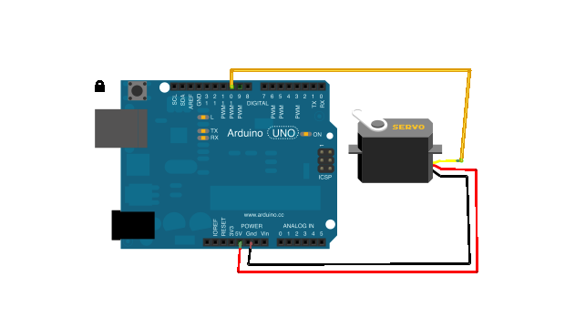

<!--remove-start-->

# Servo - Animation

<!--remove-end-->


##### Servo on pin 10


Servo connected to pin 10. Requires servo on pin that supports PWM (usually denoted by ~).


<br>

Fritzing diagram: [docs/breadboard/servo.fzz](breadboard/servo.fzz)

&nbsp;


Run this example from the command line with:
```bash
node eg/servo-animation.js
```


```javascript
const {Animation, Board, Servo} = require("johnny-five");
const board = new Board();

board.on("ready", () => {

  // Create a new `servo` hardware instance.
  const servo = new Servo(10);

  // Create a new `animation` instance.
  const animation = new Animation(servo);

  // Enqueue an animation segment with options param
  // See Animation example and docs for details
  animation.enqueue({
    cuePoints: [0, 0.25, 0.75, 1],
    keyFrames: [90, { value: 180, easing: "inQuad" }, { value: 0, easing: "outQuad" }, 90],
    duration: 2000
  });

  // Inject the `servo` hardware into
  // the Repl instance's context;
  // allows direct command line access
  board.repl.inject({
    servo,
    animation
  });
});

```


&nbsp;

<!--remove-start-->

## License
Copyright (c) 2012-2014 Rick Waldron <waldron.rick@gmail.com>
Licensed under the MIT license.
Copyright (c) 2015-2020 The Johnny-Five Contributors
Licensed under the MIT license.

<!--remove-end-->
