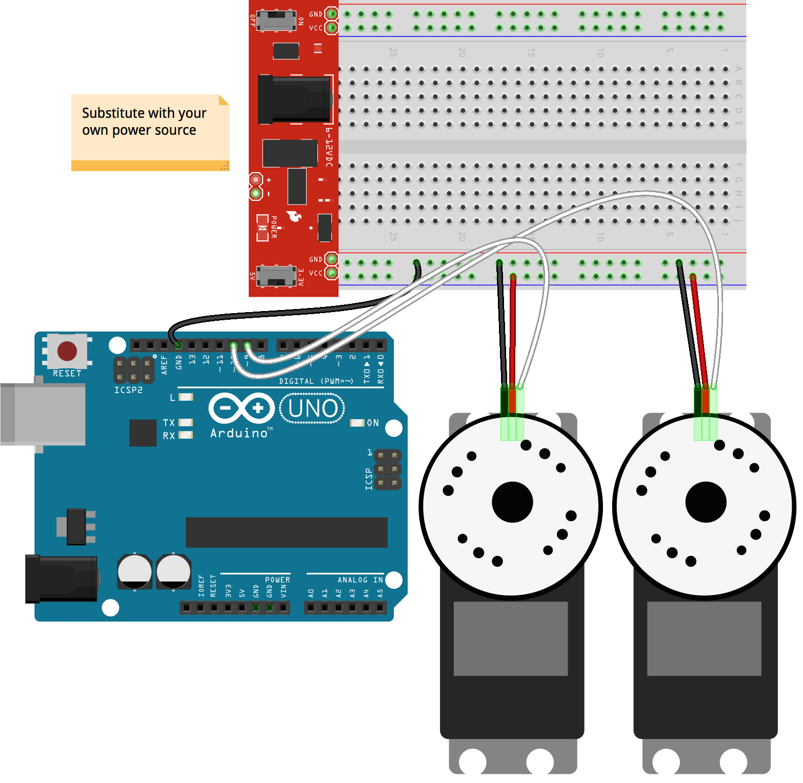

<!--remove-start-->
# Servo - - An Array of Servos

Run with:
```bash
node eg/servo-array.js
```
<!--remove-end-->

```javascript
var five = require("johnny-five");
var board = new five.Board();

board.on("ready", function() {

  // Create two example servos on pins 9 and 10
  five.Servo({
    pin: 9,
    // Limit this servo to 170°
    range: [0, 170]
  });

  five.Servo(10);

  // Initialize a collection of all active Servo instances
  var servos = new five.Servos();

  // Inject the `servo` hardware into
  // the Repl instance's context;
  // allows direct command line access
  this.repl.inject({
    servos: servos
  });


  // Servo.Array API

  // center()
  //
  // centers all servos to center of range
  // defaults to 90°
  //
  // eg. servos.center();

  servos.center();


  // min()
  //
  // set all servos to the minimum degrees
  // defaults to 0
  //
  // eg. servos.min();

  // max()
  //
  // set all servos to the maximum degrees
  // defaults to 180
  //
  // eg. servos.max();

  // to( deg )
  //
  // set all servos to deg
  //
  // eg. servos.to( deg );

  // step( deg )
  //
  // step all servos by deg
  //
  // eg. servos.step( -20 );

  // stop()
  //
  // stop all servos
  //
  // eg. servos.stop();

  // each( callbackFn )
  //
  // Execute callbackFn for each active servo instance
  //
  // eg.
  // servos.each(function( servo, index ) {
  //
  //  `this` refers to the current servo instance
  //
  // });

});

```


## Breadboard/Illustration



[docs/breadboard/servo-array.fzz](breadboard/servo-array.fzz)


<!--remove-start-->
## License
Copyright (c) 2012, 2013, 2014 Rick Waldron <waldron.rick@gmail.com>
Licensed under the MIT license.
Copyright (c) 2014, 2015 The Johnny-Five Contributors
Licensed under the MIT license.
<!--remove-end-->
