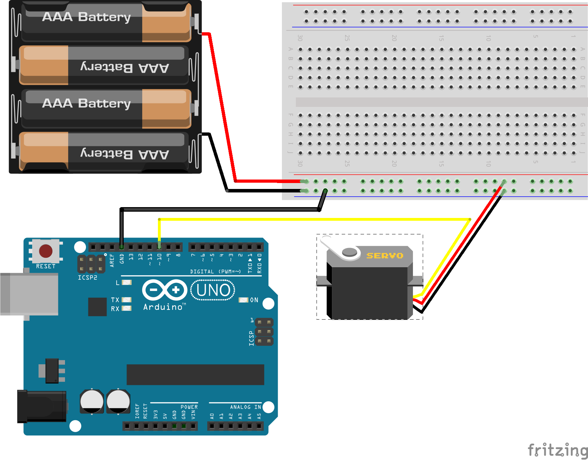

# Servo Keypress

Run with:
```bash
node eg/servo-keypress.js
```


```javascript
var five = require("johnny-five"),
  keypress = require("keypress"),
  board;

keypress(process.stdin);

board = new five.Board();

board.on("ready", function() {

  console.log("Let's test a simple servo. Use Up and Down arrows for CW and CCW respectively. Space to stop.");

  var servo = new five.Servo({
    pin: "10",
    type: "continuous"
  }).stop();

  process.stdin.resume();
  process.stdin.setEncoding("utf8");
  process.stdin.setRawMode(true);

  process.stdin.on("keypress", function(ch, key) {

    if (!key) {
      return;
    }

    if (key.name === "q") {

      console.log("Quitting");
      process.exit();

    } else if (key.name === "up") {

      console.log("CW");
      servo.cw();

    } else if (key.name === "down") {

      console.log("CCW");
      servo.ccw();

    } else if (key.name === "space") {

      console.log("Stopping");
      servo.stop();

    }

  });

});

```


## Breadboard/Illustration



[docs/breadboard/servo-keypress.fzz](breadboard/servo-keypress.fzz)


## License
Copyright (c) 2012, 2013, 2014 Rick Waldron <waldron.rick@gmail.com>
Licensed under the MIT license.
Copyright (c) 2014, 2015 The Johnny-Five Contributors
Licensed under the MIT license.
