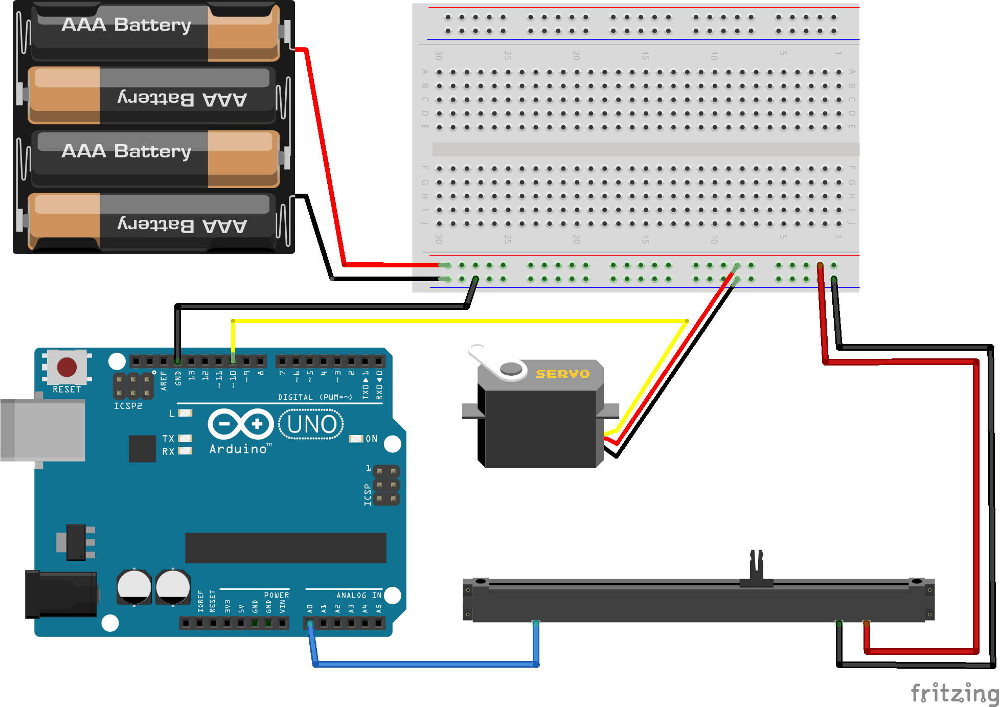

<!--remove-start-->

# Servo - Slider control

<!--remove-end-->


##### Breadboard for "Servo - Slider control"


<br>

Fritzing diagram: [docs/breadboard/servo-slider.fzz](breadboard/servo-slider.fzz)

&nbsp;


Run this example from the command line with:
```bash
node eg/servo-slider.js
```


```javascript
const {Board, Sensor, Servo} = require("johnny-five");
const board = new Board();

board.on("ready", () => {

  const slider = new Sensor("A0");
  const tilt = new Servo(10);

  slider.on("change", () => {
    tilt.to(slider.scaleTo(0, 180));
  });
});

```


&nbsp;

<!--remove-start-->

## License
Copyright (c) 2012-2014 Rick Waldron <waldron.rick@gmail.com>
Licensed under the MIT license.
Copyright (c) 2015-2020 The Johnny-Five Contributors
Licensed under the MIT license.

<!--remove-end-->
