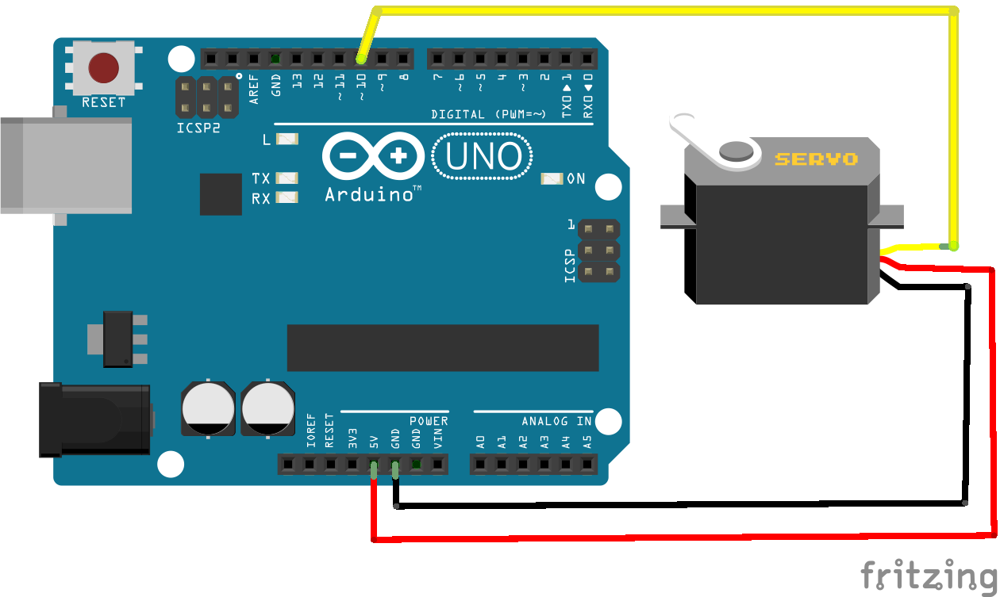

# Servo Sweep

Run with:
```bash
node eg/servo-sweep.js
```


```javascript
var five = require("johnny-five"),
  board = new five.Board();

board.on("ready", function() {
  var servo = new five.Servo({
    pin: 10,
    range: [0, 180],
    startAt: 0
  });
  var lap = 0;

  servo.center();

  servo.sweep().on("sweep:full", function() {
    console.log("lap", ++lap);

    if (lap === 1) {
      this.sweep({
        range: [40, 140],
        step: 10
      });
    }

    if (lap === 2) {
      this.sweep({
        range: [60, 120],
        step: 5
      });
    }

    if (lap === 3) {
      this.sweep({
        range: [80, 100],
        step: 1
      });
    }

    if (lap === 5) {
      process.exit(0);
    }
  });
});

```


## Breadboard/Illustration



[docs/breadboard/servo-sweep.fzz](breadboard/servo-sweep.fzz)


## License
Copyright (c) 2012-2013 Rick Waldron <waldron.rick@gmail.com>
Licensed under the MIT license.
Copyright (c) 2014 The Johnny-Five Contributors
Licensed under the MIT license.
