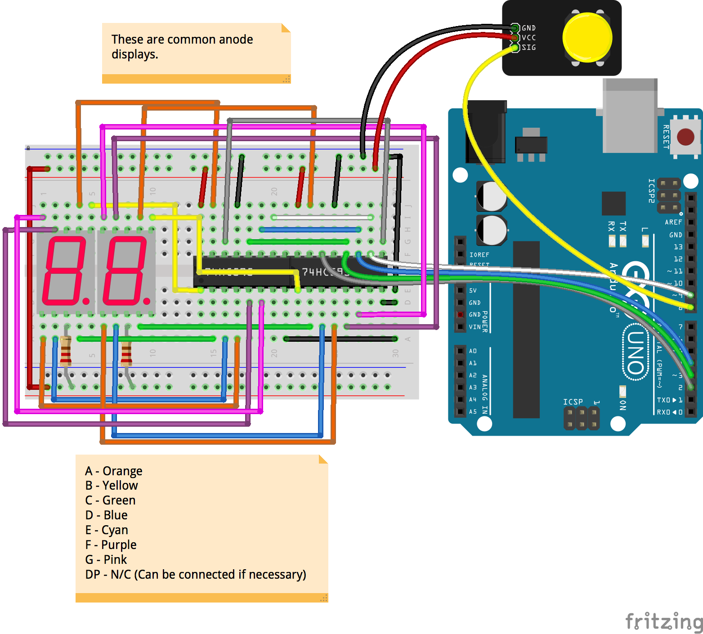

<!--remove-start-->

# Shift Register - Common Anode Seven segments, Chained

<!--remove-end-->


##### Breadboard for "Shift Register - Common Anode Seven segments, Chained"


<br>

Fritzing diagram: [docs/breadboard/shift-register-daisy-chain-anode.fzz](breadboard/shift-register-daisy-chain-anode.fzz)

&nbsp;


Run this example from the command line with:
```bash
node eg/shift-register-daisy-chain-anode.js
```


```javascript
const {Board, Button, ShiftRegister} = require("johnny-five");
const {eachSeries} = require("async");
const board = new Board();

board.on("ready", () => {

  /**
   * While we may have multiple ShiftRegisters,
   * we only need one to control them both.
   */
  const register = new ShiftRegister({
    isAnode: true,
    size: 2,
    pins: {
      data: 2,
      clock: 3,
      latch: 4,
      reset: 9,
    }
  });

  /**
   * Pressing this button will trigger the die roll.
   */
  const button = new Button(8);

  /**
   * Sends a random number to the shift register.
   */
  function randomNumber() {
    register.clear();
    return register.display(Math.round(Math.random() * 20));
  }

  /**
   * This is an array of delays in ms.  When a button is pressed,
   * we'll iterate over this array and display a random number after the
   * delay.  This simulates a die bouncing on a table.
   */
  const delays = [
    16, 16, 16, 16, 16, 16, 16, 16, 16, 16,
    32, 32, 32, 32, 32, 32, 32, 32,
    64, 64, 64, 64, 64, 64,
    128, 128, 128, 128,
    256, 256,
    512,
  ];

  register.reset();
  register.clear();

  button.on("press", () => {
    console.log("Rolling...");
    register.clear();
    eachSeries(delays, (delay, done) => {
      randomNumber();
      setTimeout(() => {
        register.clear();
        done();
      }, delay);
    }, randomNumber);
  });
});

```


&nbsp;

<!--remove-start-->

## License
Copyright (c) 2012-2014 Rick Waldron <waldron.rick@gmail.com>
Licensed under the MIT license.
Copyright (c) 2015-2020 The Johnny-Five Contributors
Licensed under the MIT license.

<!--remove-end-->
