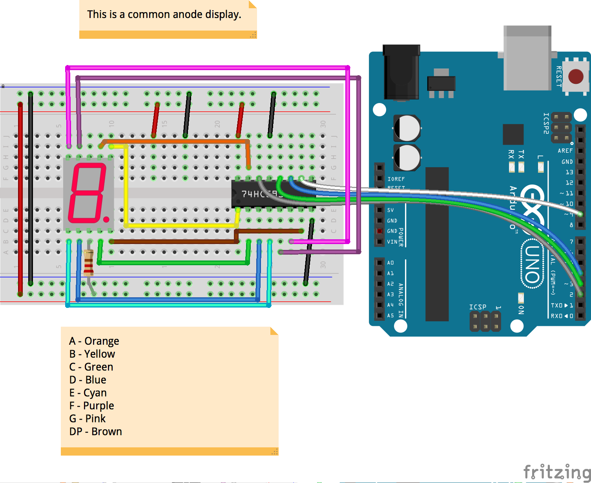

<!--remove-start-->

# Shift Register - Common Anode Seven Segment controller

<!--remove-end-->


##### Breadboard for "Shift Register - Common Anode Seven Segment controller"


<br>

Fritzing diagram: [docs/breadboard/shift-register-seven-segment-anode.fzz](breadboard/shift-register-seven-segment-anode.fzz)

&nbsp;


Run this example from the command line with:
```bash
node eg/shift-register-seven-segment-anode.js
```


```javascript
var five = require("johnny-five");
var board = new five.Board();

board.on("ready", function() {
  var register = new five.ShiftRegister({
    isAnode: true,
    pins: {
      data: 2,
      clock: 3,
      latch: 4,
      reset: 9,
    }
  });
  var number = 0;
  var decimal = 0;

  register.reset();

  // Display numbers 0-9, one at a time in a loop.
  // Shows just the number for a half second, then
  // the number + a decimal point for a half second.
  setInterval(function() {
    register.display(number + (decimal && "."));

    if (decimal) {
      number++;
    }

    if (number > 9) {
      number = 0;
    }

    decimal ^= 1;
  }, 500);
});

```


&nbsp;

<!--remove-start-->

## License
Copyright (c) 2012, 2013, 2014 Rick Waldron <waldron.rick@gmail.com>
Licensed under the MIT license.
Copyright (c) 2017 The Johnny-Five Contributors
Licensed under the MIT license.

<!--remove-end-->
