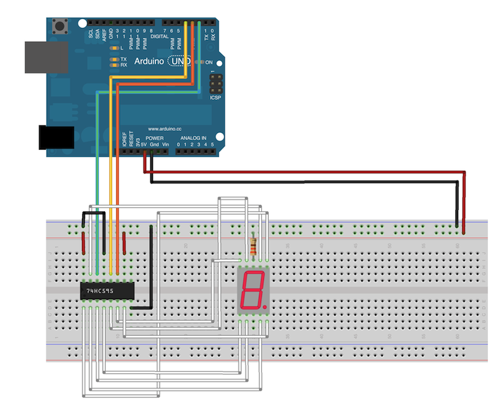

<!--remove-start-->

# Shift Register - Seven Segment controller

<!--remove-end-->


##### Breadboard for "Shift Register - Seven Segment controller"


<br>

Fritzing diagram: [docs/breadboard/shift-register-seven-segment.fzz](breadboard/shift-register-seven-segment.fzz)

&nbsp;


Run this example from the command line with:
```bash
node eg/shift-register-seven-segment.js
```


```javascript
const {Board, ShiftRegister} = require("johnny-five");
const board = new Board();

board.on("ready", () => {
  const register = new ShiftRegister({
    pins: {
      data: 2,
      clock: 3,
      latch: 4,
    }
  });
  let number = 0;
  let decimal = 0;

  // Display numbers 0-9, one at a time in a loop.
  // Shows just the number for a half second, then
  // the number + a decimal point for a half second.
  setInterval(() => {
    register.display(number + (decimal && "."));

    if (decimal) {
      number++;
    }

    if (number === 10) {
      number = 0;
    }

    decimal ^= 1;
  }, 500);
});

```


&nbsp;

<!--remove-start-->

## License
Copyright (c) 2012-2014 Rick Waldron <waldron.rick@gmail.com>
Licensed under the MIT license.
Copyright (c) 2015-2020 The Johnny-Five Contributors
Licensed under the MIT license.

<!--remove-end-->
