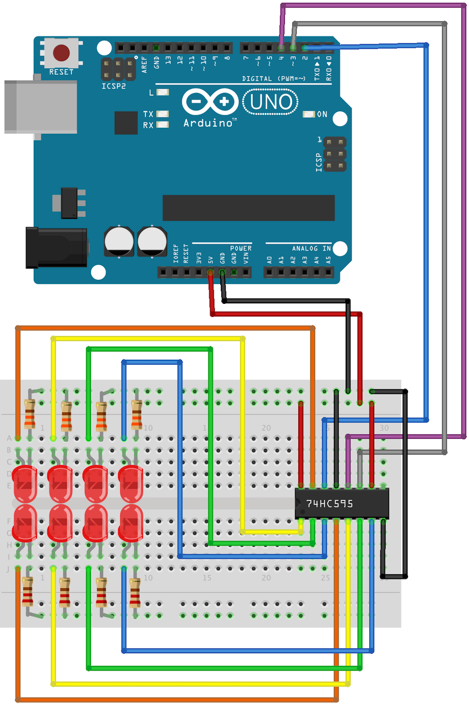

<!--remove-start-->

# Shift Register

<!--remove-end-->


##### Breadboard for "Shift Register"


<br>

Fritzing diagram: [docs/breadboard/shift-register.fzz](breadboard/shift-register.fzz)

&nbsp;


Run this example from the command line with:
```bash
node eg/shift-register.js
```


```javascript
const {Board, ShiftRegister} = require("johnny-five");
const board = new Board();

// For use with 74HC595 chip

board.on("ready", () => {
  const register = new ShiftRegister({
    pins: {
      data: 2,
      clock: 3,
      latch: 4
    }
  });

  let value = 0b00000000;
  let upper = 0b10001000;
  let lower = 0b00010001;

  function next() {
    register.send(value = value > lower ? value >> 1 : upper);
    setTimeout(next, 200);
  }

  next();
});

```


&nbsp;

<!--remove-start-->

## License
Copyright (c) 2012-2014 Rick Waldron <waldron.rick@gmail.com>
Licensed under the MIT license.
Copyright (c) 2015-2020 The Johnny-Five Contributors
Licensed under the MIT license.

<!--remove-end-->
