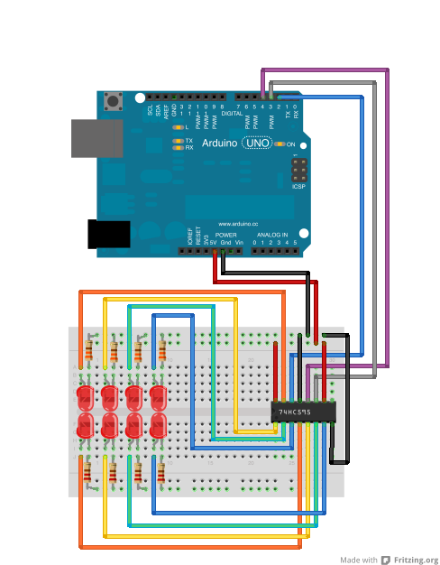

# Shiftregister

Run with:
```bash
node eg/shiftregister.js
```


```javascript
var five = require("../lib/johnny-five"),
    board, shiftRegister;

board = new five.Board();

// This works with the 74HC595 that comes with the SparkFun Inventor's kit.
// Your mileage may vary with other chips. For more information on working
// with shift registers, see http://arduino.cc/en/Tutorial/ShiftOut

board.on("ready", function() {
  shiftRegister = new five.ShiftRegister({
    pins: {
      data: 2,
      clock: 3,
      latch: 4
    }
  });

  var value = 0;

  function next() {
    value = value > 0x11 ? value >> 1 : 0x88;
    shiftRegister.send( value );
    setTimeout(next, 200);
  }

  next();

});

```


## Breadboard/Illustration



[docs/breadboard/shiftregister.fzz](breadboard/shiftregister.fzz)


## Contributing
All contributions must adhere to the [Idiomatic.js Style Guide](https://github.com/rwldrn/idiomatic.js),
by maintaining the existing coding style. Add unit tests for any new or changed functionality. Lint and test your code using [grunt](https://github.com/cowboy/grunt).

## License
Copyright (c) 2012 Rick Waldron <waldron.rick@gmail.com>
Licensed under the MIT license.
