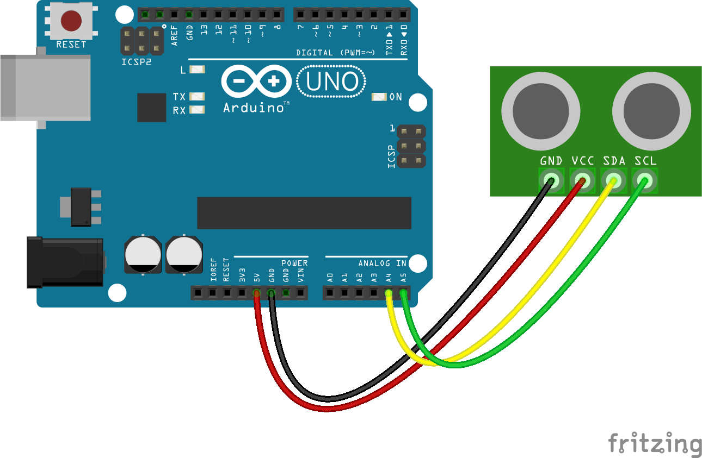

<!--remove-start-->

# Sonar - I2C SRF10

<!--remove-end-->


### Breadboard for "Sonar - I2C SRF10"


<br>

Fritzing diagram: [docs/breadboard/sonar-srf10.fzz](breadboard/sonar-srf10.fzz)

&nbsp;


Run with:
```bash
node eg/sonar-srf10.js
```


```javascript
var five = require("johnny-five");
var board = new five.Board();

board.on("ready", function() {

  var sonar = new five.Sonar({
    device: "SRF10"
  });

  function display(type, value, unit) {
    console.log("%s event: object is %d %s away", type, value, unit);
  }

  sonar.on("data", function() {
    display("data", this.inches, "inches");
  });

  sonar.on("change", function() {
    display("data", this.inches, "inches");
  });
});

```


&nbsp;

<!--remove-start-->

## License
Copyright (c) 2012, 2013, 2014 Rick Waldron <waldron.rick@gmail.com>
Licensed under the MIT license.
Copyright (c) 2014, 2015 The Johnny-Five Contributors
Licensed under the MIT license.

<!--remove-end-->
