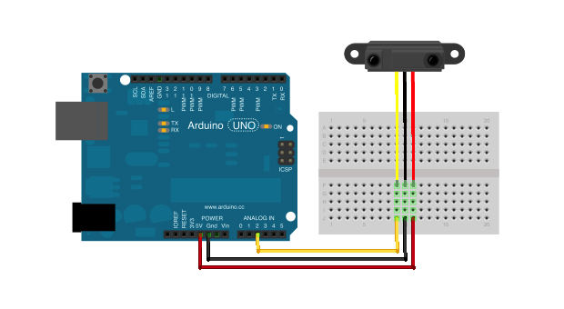

# Sonar

Run with:
```bash
node eg/sonar.js
```


```javascript
var five = require("johnny-five"),
    board, sonar;

board = new five.Board();

board.on("ready", function() {

  // Create a new `sonar` hardware instance.
  sonar = new five.Sonar("A2");

  // Sonar Properties

  // sonar.voltage
  //
  // Raw voltage
  //

  // sonar.inches
  //
  // Distance reading in inches
  //

  // sonar.cm
  //
  // Distance reading in centimeters
  //


  // Sonar Event API
  //
  // "read" fired continuously
  //
  sonar.on("read", function( err, timestamp ) {
    /*

      this.voltage - raw voltage reading
      this.inches  - calculated distance, inches
      this.cm  - calculated distance, centimeters

    */
    console.log( "read", "Object is " + this.inches + "inches away" );
  });

  //
  // "change" fired when distance reading changes
  //
  sonar.on("change", function( err, timestamp ) {
    console.log( "change", "Object is " + this.inches + "inches away" );
  });
});

```

## Breadboard/Illustration


[docs/breadboard/sonar.fzz](breadboard/sonar.fzz)


## Devices


## Documentation

_(Nothing yet)_


## Contributing
All contributions must adhere to the [Idiomatic.js Style Guide](https://github.com/rwldrn/idiomatic.js),
by maintaining the existing coding style. Add unit tests for any new or changed functionality. Lint and test your code using [grunt](https://github.com/cowboy/grunt).

## Release History
_(Nothing yet)_

## License
Copyright (c) 2012 Rick Waldron <waldron.rick@gmail.com>
Licensed under the MIT license.
