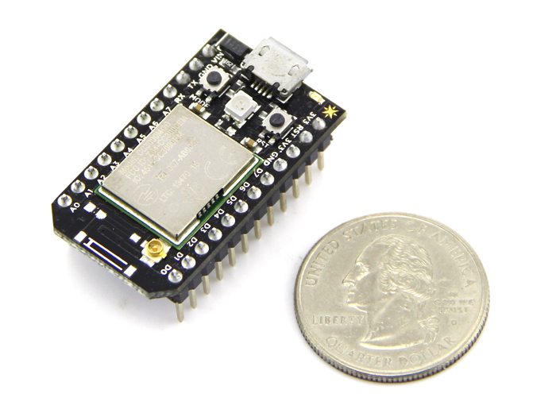

<!--remove-start-->

# Led Blink on Spark Core

<!--remove-end-->


Example using Johnny-Five + Spark-io to control a Spark Core device wirelessly.


##### LED on pin D1


<br>

Fritzing diagram: [docs/breadboard/spark-led.fzz](breadboard/spark-led.fzz)

&nbsp;


Run this example from the command line with:
```bash
node eg/spark-io.js
```


```javascript
var five = require("johnny-five");
var Spark = require("spark-io");
var board;

// Create Johnny-Five board connected via Spark.
// Assumes access tokens are stored as environment variables
// but you can enter them directly below instead.
board = new five.Board({
  io: new Spark({
    token: process.env.SPARK_TOKEN,
    deviceId: process.env.SPARK_DEVICE_ID
  })
});

board.on("ready", function() {
  console.log("CONNECTED");

  // Once connected, we can do normal Johnny-Five stuff
  var led = new five.Led("D1");
  led.blink();

});


```


## Illustrations / Photos


### Spark Core Wifi Device


  


## Additional Notes
In order to use the spark-io library, you will need to load the special
[voodoospark](https://github.com/voodootikigod/voodoospark) firmware onto your
device. We recommend you review [VoodooSpark's Getting Started](https://github.com/voodootikigod/voodoospark#getting-started) before continuing.
We also recommend storing your Spark token and device ID in a dot file so they can be accessed as properties of `process.env`. Create a file in your home directory called `.sparkrc` that contains:
```sh
export SPARK_TOKEN="your spark token"
export SPARK_DEVICE_ID="your device id"
```
Then add the following to your dot-rc file of choice:
```sh
source ~/.sparkrc
```
Ensure your host computer (where you're running your Node application) and the Spark are on the same local network.


## Learn More

- [spark-io on GitHub](https://github.com/rwaldron/spark-io)

&nbsp;

<!--remove-start-->

## License
Copyright (c) 2012-2014 Rick Waldron <waldron.rick@gmail.com>
Licensed under the MIT license.
Copyright (c) 2015-2020 The Johnny-Five Contributors
Licensed under the MIT license.

<!--remove-end-->
