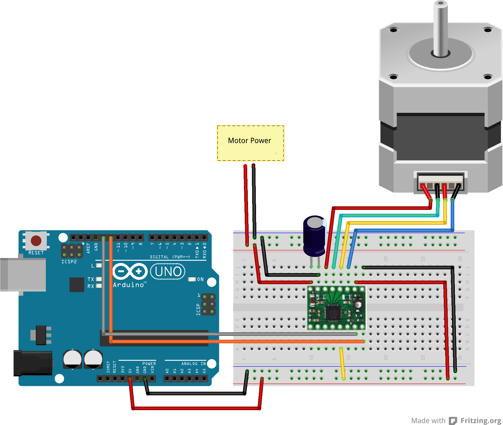
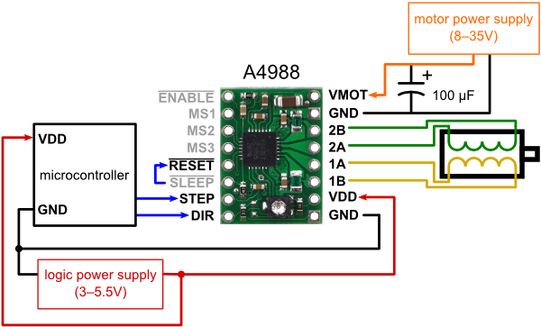

# Stepper Driver

Run with:
```bash
node eg/stepper-driver.js
```


```javascript
var five = require("../lib/johnny-five");

var board = new five.Board();

board.on("ready", function() {

  /**
   * var stepper = new five.Stepper({
   *   type: five.Stepper.TYPE.DRIVER,
   *   stepsPerRev: 200,
   *   pins: {
   *     step: 11,
   *     dir: 12
   *   }
   * });
  */

  var stepper = new five.Stepper({
    type: five.Stepper.TYPE.DRIVER,
    stepsPerRev: 200,
    pins: [ 11, 12 ]
  });

  // Make 10 full revolutions counter-clockwise at 180 rpm with acceleration and deceleration
  stepper.rpm(180).ccw().accel(1600).decel(1600).step(2000, function() {

    console.log("Done moving CCW");

    // once first movement is done, make 10 revolutions clockwise at previously
    //      defined speed, accel, and decel by passing an object into stepper.step
    stepper.step({ steps: 2000, direction: five.Stepper.DIRECTION.CW }, function() {
      console.log("Done moving CW");
    });
  });
});


```


## Breadboard/Illustration



[docs/breadboard/stepper-driver.fzz](breadboard/stepper-driver.fzz)


- [A4988 Stepper Motor Driver Carrier](http://www.pololu.com/catalog/product/1182)
- [100uf 35v electrolytic cap](http://www.amazon.com/100uF-Radial-Mini-Electrolytic-Capacitor/dp/B0002ZP530)
- [Stepper Motor (4 wire, bipolar)](https://www.sparkfun.com/products/9238)




## Contributing
All contributions must adhere to the [Idiomatic.js Style Guide](https://github.com/rwldrn/idiomatic.js),
by maintaining the existing coding style. Add unit tests for any new or changed functionality. Lint and test your code using [grunt](https://github.com/cowboy/grunt).

## License
Copyright (c) 2012 Rick Waldron <waldron.rick@gmail.com>
Licensed under the MIT license.
