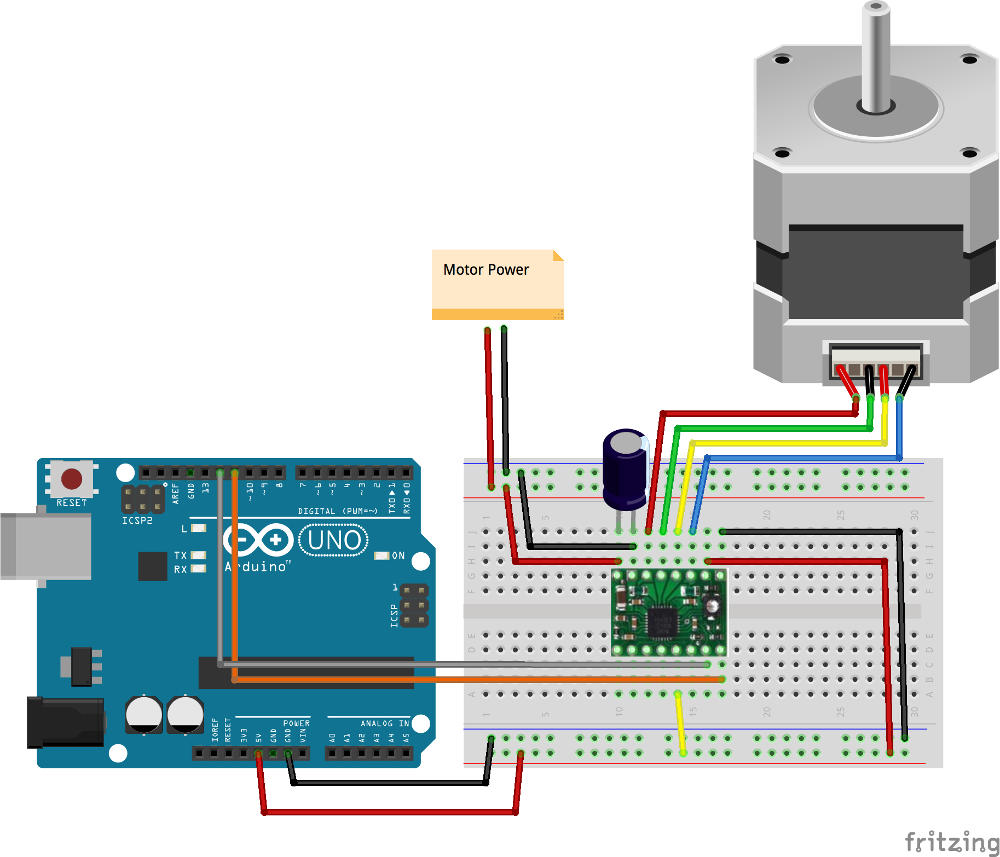

# Stepper using stepper driver with dir/step pins

Note about using the stepper functionality: The firmware support is not currently in StandardFirmata

AdvancedFirmata has the support for asynchronously controlling steppers: https://github.com/soundanalogous/AdvancedFirmata/


Run with:
```bash
node eg/stepper-driver.js
```


```javascript
var five = require("johnny-five");

var board = new five.Board();

board.on('ready', function() {
  var stepperConfig = {
    type: board.firmata.STEPPER.TYPE.DRIVER,
    stepsPerRev: 200,
    pins: {
      step: 13,
      dir: 12
    }
  };

  var stepper = new five.Stepper(stepperConfig);

  // make 10 full revolutions counter-clockwise at 180 rpm with acceleration and deceleration
  stepper.rpm(180).direction(board.firmata.STEPPER.DIRECTION.CCW).accel(1600).decel(1600).step(2000, function() {
    console.log("done moving CCW")
  });
})
```

## Breadboard/Illustration


[docs/breadboard/stepper-driver.fzz](breadboard/stepper-driver.fzz)


## Devices


